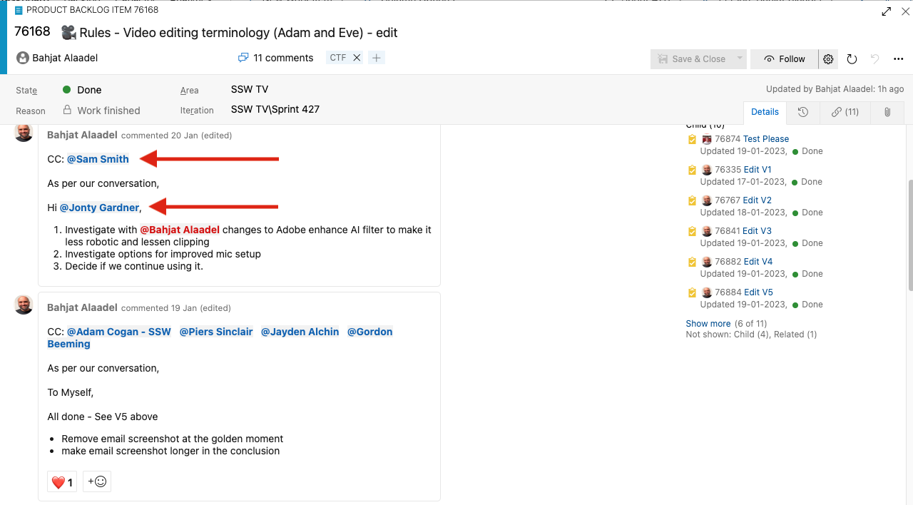
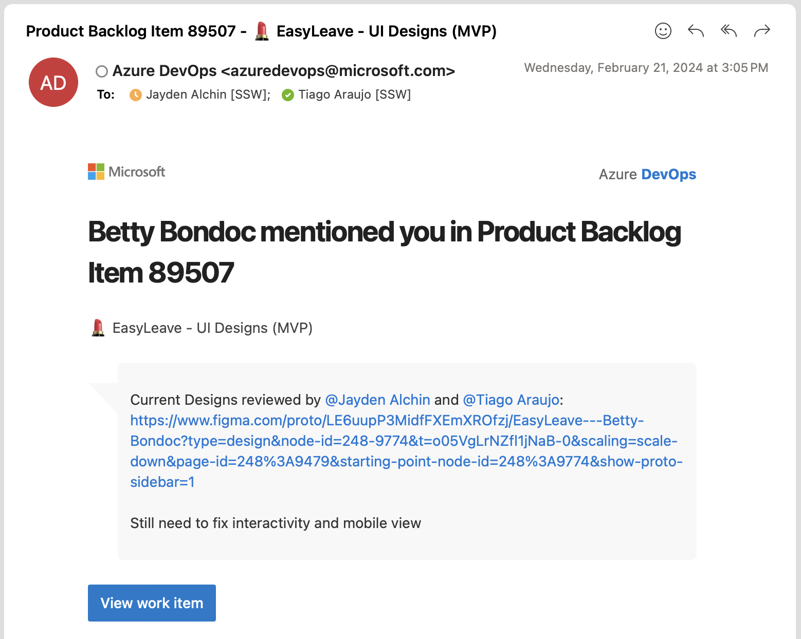

When the Product Owner makes a verbal change request or decision, you might consider sending an email and CCing others, but that limits visibility to only those on the thread.

A better approach is to **update the PBI** to document the change, making the conversation visible to the entire team. Use **comments and mentions (@username)** to notify the Product Owner and any relevant team members. This ensures they receive email notifications about the update.

<!--endintro-->

## ✅ The benefits of using comments with @mentions on PBIs

* Quick and easy, no need to compose an email
* History is visible to anyone looking at the PBI (with email, if you don't CC them, they wouldn't have a clue)
* Easy to see all important information in one place, instead of digging through email

### How it works

Say the Product Owner asks you to prioritize and update PBI 1234.

::: email-template  

| | |
| -------- | --- |
| To: | {{ TO MYSELF }} |
| Cc: | {{ PRODUCT OWNER }}, {{ RELEVANT PEOPLE }} |
| Subject: | SugarLearning - Use third party for quiz engine |  
::: email-content

### To myself

As per my conversation with the PO, we want to use a third party quiz engine instead of building our own. This is a priority.

:::  
:::  
::: bad
Figure: Bad example – Don't use emails for tasks updates
:::

::: info
**Exception:** You may send a ["To Myself" email](/send-to-myself-emails) and CC relevant people **when there is no Product Backlog** related to the request.
:::

::: greybox
_"I have found and updated the PBI and moved it near the top of the backlog"_
:::
::: bad
Bad example - Change documented in the backlog, but no @mention used
:::

::: greybox
_"I have found and updated the PBI, prioritized it near the top of the backlog, and @mentioned you and relevant team members so you know when it is actioned"_
:::
::: good
Good example - Change documented in the backlog and @mention included
:::

### Format PBI comments like an email

Try formatting your mentions like an email to clarify both accountability and responsiblity and identify the current status of the project. This is especially useful when [requesting a "test please"](/request-a-test-please).

**Note:** You can and should use @mention on **pull requests** as well.

::: good

:::

::: greybox

### Use YakShaver and make it even easier

You can save time by not writing change requests manually.

With [YakShaver](https://yakshaver.ai), simply record your message and let the AI do the rest. YakShaver writes a clear and complete PBI, GitHub Issue, or even an email (for projects without a backlog), mentioning the right people and assigning it to the correct team.
:::

### How @mentions work

Below are examples of how mentions work in different platforms.

#### GitHub Issues

::: good

:::

#### Azure DevOps PBIs

::: good

:::

::: good

:::

---

## Related suggestion

* [Suggestion to Microsoft Azure DevOps - Help me know there is an image in the Work Item](https://bettersoftwaresuggestions.com/microsoft/azure-devops/help-me-know-there-is-an-image-in-the-work-item/)
