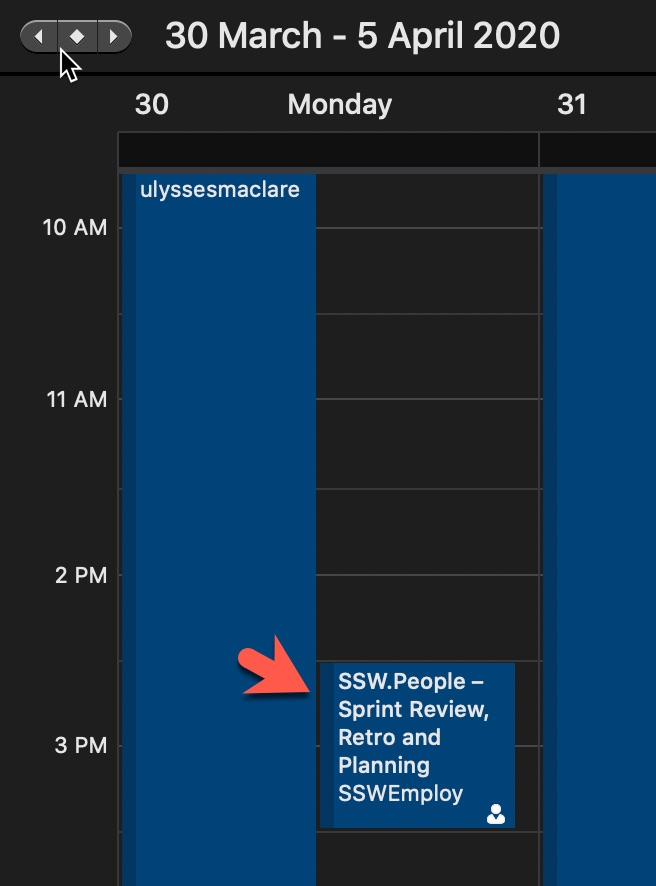
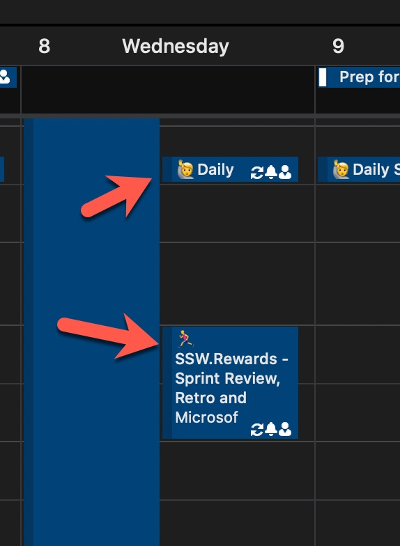

Emojis make it easier for people to quickly workout what type of content is coming up and to highlight important stuff. It works nicely for meetings, backlogs, and more.

<!--endintro-->

An easy and fun way to have use emojis consistently in Scrum is to follow the list on [scrumoji - An emoji guide for your agile communication](https://www.scrumoji.org/).

**Tip:** Use the "Windows Key" + "." to see the emojis in your screen.

### Document it

If standard emojis aren't defined in the project documentation then new starters will be confused about what emojis to use. That adds cognitive load and makes the process more trouble than it's worth for developers.

So creating documentation that outlines the standard set of emojis to use is crucial. Then developers can just pick the emoji that most closely fits their PBI. For example, you might have the following emojis defined:

::: greybox
💄 UI

📃 Documentation

🐛 Bug

✨ New Feature

🔍 Investigate

📈 Report

⚒️ DevOps

🎥 Video

♻️ Refactor
:::

Try not to go overboard, keeping it simple makes it easier for developers to pick the right emoji.

::: bad

:::

::: good

:::
