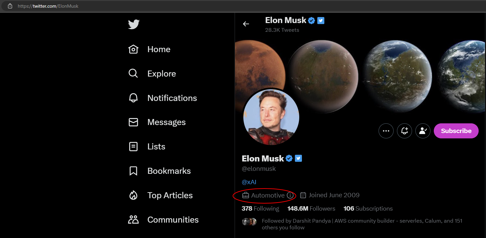

If you are using your X account for business, there are benefits to be had from using [X Business](https://business.x.com/en).

<!--endintro-->

X Business is free to activate in the settings of your X account. It provides:

* **Additional Profile Information:** More profile information and links, freeing up space in your bio for more detail
* **Newsletters:** You can set up a mailing list, send out regular content, and advertise the subscription link on your profile
* **Ticketed Twitter Spaces:** Host live audio events with speakers and Q&A sessions and sell tickets to monetize them
* **Super Follows:** By activating Super Follows you can charge followers who want to receive extra content
* **Tips:** Users can leave you a tip for a tweet
* **Quick Promote:** Easier set up for ads without going through the X Ads page

It is ideal to use for businesses or for content creators looking to monetize their account.

::: good

:::
