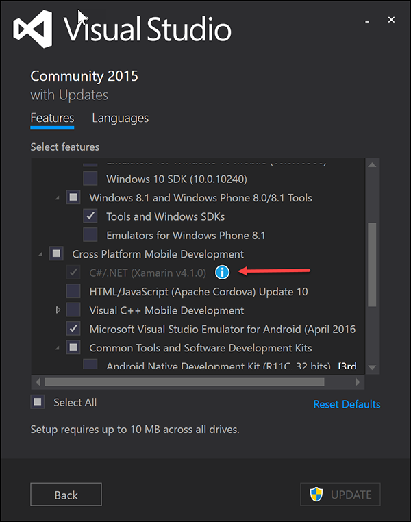
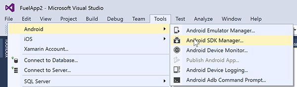
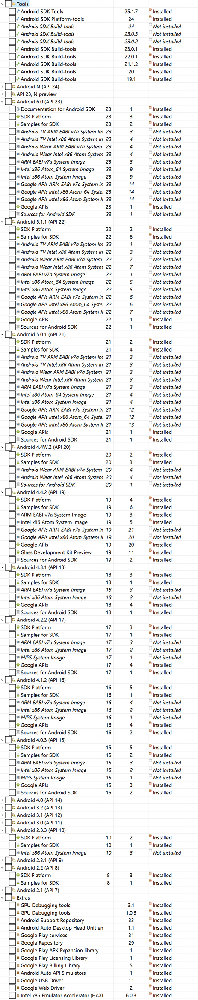
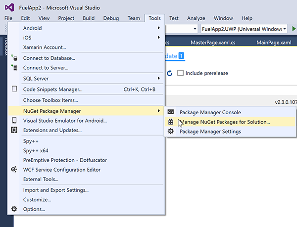
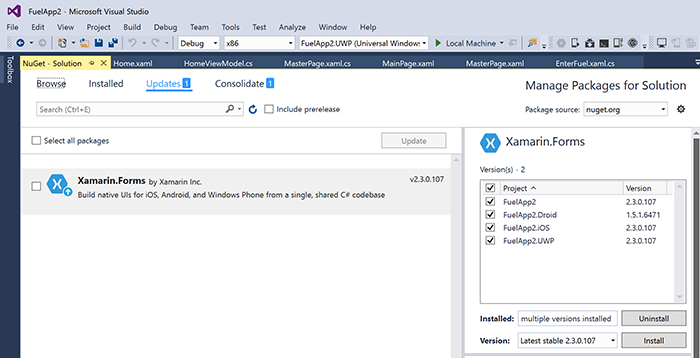

Installing Visual Studio is not enough.... There is another 2 hours plus of downloading and installing to get to your first successful Xamarin hello world app.

<!--endintro-->

### Step 1

Install VS 2015 + the Xamarin extension: <https://msdn.microsoft.com/en-us/library/mt613162.aspx?WT.mc_id=DT-MVP-33518>

**Note:** Xamarin Studio doesn't exist on the PC anymore.

### Step 2 - Android SDK Manager (about 2 hours)

This one is painful...

Then get all the ones that say "Installed" :

### Step 3 - "Manage NuGet Packages for Solution" (about 30 minutes)

Create a Blank App (xamarin.Forms Portable) project (this way it will trigger grabbing all extra stuff).
Check and ensure Nuget Packages are up to date .

### Step 4 - run the app

Actually run the application you’ve created. Ensure it builds. It won't =D well first time it often won't, if it does then congratulations you have got everything!
