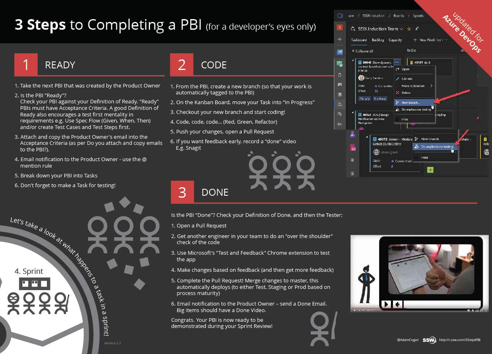

A PBI (Product Backlog Item) is a term commonly used in Agile project management and software development to represent a unit of work. It refers to an item in the Product Backlog, which is a prioritized list of features, enhancements, or fixes to be addressed in a project.

Before a PBI is worked on it should be added to the current Sprint Backlog during [Sprint Planning](/what-happens-at-a-sprint-planning-meeting). If your PBI doesn't exist, or is in an email then you need to [turn it into a PBI](/turn-emails-into-pbis) to be prioritized in Sprint Planning.

Once a PBI is in the Sprint Backlog, it's lifecycle can be broken down into 3 steps:

<!--endintro-->

## 1. Ready

You have a Sprint Backlog of PBIs (tasks, features, and fixes) which are already prioritized and approved by the [Product Owner](/rules-to-better-product-owners)

1. Choose a PBI and assign yourself to it
2. Double check the [Definition of Ready](/have-a-definition-of-ready)
3. Break the PBI into tasks (optional)

## 2. Time to Code

This step depends on the complexity and nature of the task, especially if the PBI involves intricate coding or extensive testing to meet the defined [Acceptance Criteria](/acceptance-criteria).

1. Move PBI to "In Progress"
2. Create a branch
3. Code, code, code... ([make sure to Red-Green-Refactor](reply-done-plus-added-a-unit-test))
4. Make a Pull Request with [lots of context](/write-a-good-pull-request)
5. Get an ["over the shoulder"](/over-the-shoulder) review
6. Record a [Done Video](/record-a-quick-and-dirty-done-video) so you get your ducks in a row for the explanation to the Product Owner
7. Show the Product Owner so they give you earlier feedback
8. Action the feedback (and then get more feedback)
9. Check your [Definition of Done](/definition-of-done) and complete the Pull Request!

## 3. Done

This should be the easiest part!

1. Check code is deployed 🚀
2. Reply 'done' to the PBI and also in the email thread, as per [when to send a 'done' email in Scrum](/done-do-you-know-when-to-send-a-done-email-in-scrum)

   **Note:** Remember to [close PBIs, tasks and goals with context](/close-pbis-with-context)

3. Close the PBI

Congrats, your PBI is ready to be demonstrated during your Sprint Review!

::: good

:::

Print out the [SSW 3 Steps to a PBI PDF](3-steps-to-a-pbi.pdf) and put it on your "War Room" wall.
