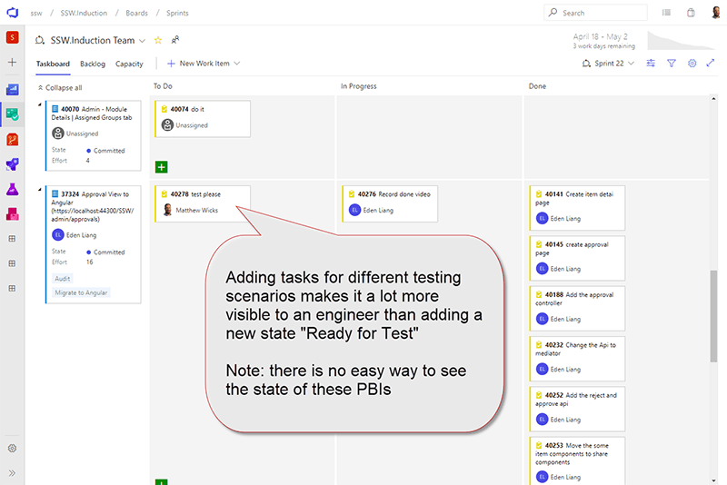
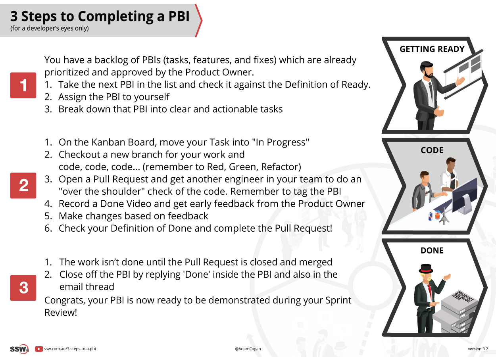

A PBI (Product Backlog Item) is a term commonly used in Agile project management and software development to represent a unit of work or an item in the Product Backlog, which is a prioritized list of features, enhancements, or fixes to be addressed in a project.

From a developer's viewpoint, the lifecycle of a PBI can be broken down into 3 steps:

<!--endintro-->

### Before it's ready

Got an email with tasks or bugs? [Add them to the Product Backlog as PBIs](/turn-emails-into-pbis) as soon as possible!

Next, check the PBI against the [Definition of Ready](/have-a-definition-of-ready).

### 1. PBI is Ready

You have a backlog of PBIs (tasks, features, and fixes) which are already prioritized and approved by the [Product Owner](/rules-to-better-product-owners)

1. Take the next PBI in the list by assigning it to yourself
2. Break down that PBI into clear and actionable tasks

### 2. Time to Code

This step depends on the complexity and nature of the task, especially if the PBI involves intricate coding or extensive testing to meet the defined [Acceptance Criteria](/acceptance-criteria).

1. From the PBI, create a new branch (so that your work is automatically tagged to the PBI)
2. On the Kanban Board, move your Task into "In Progress"
3. Checkout your new branch and code, code, code... (remember to [Red, Green, Refactor](/reply-done-plus-added-a-unit-test))
4. Open a Pull Request and get another engineer in your team to do an "over the shoulder" check of the code
5. Record a [Done Video](/record-a-quick-and-dirty-done-video) so you get your ducks in a row for the explanation to the Product Owner, and so they give you earlier feedback.
6. Make changes based on feedback (and then get more feedback)
7. Check your [Definition of Done](/definition-of-done) and complete the Pull Request!

### 3. Done

This should be easiest part!

1. Close off the PBI by replying 'Done' inside the PBI and also in the email thread. As per [when to send a 'done' email in Scrum](/done-do-you-know-when-to-send-a-done-email-in-scrum)

Congrats, your PBI is now ready to be demonstrated during your Sprint Review!

::: good

:::
