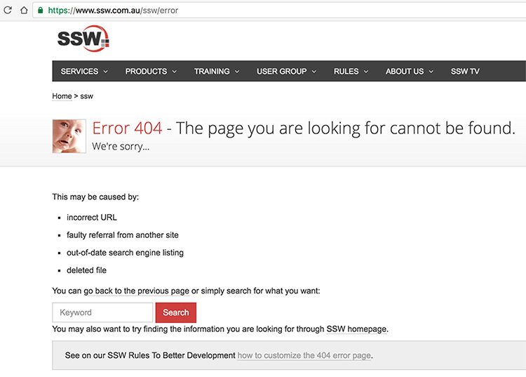

When you request a URL of a file that doesn't exist, you will get an error message. You should make sure that the URL in the browser doesn't change. This way, it's easy for the user to correct. 

E.g. The user doesn't have to retype the whole URL if there is a spelling mistake or a forgotten/mixed up letter.

<!--endintro-->

In ASP.NET you are allowed to define a custom error page. When a user tries to access a URL which doesn't exist, ASP.NET changes the URL and redirects to the custom error page. The original URL is passed as a parameter to the new URL.

::: greybox
**Note:** This is for ASP.NET, not ASP.NET Core, the newer iteration handles this situation in a more user-friendly manner by default.
:::

The advantage of this solution is, that the page looks nice and you can customize it according to the design and layout of your whole site.

The disadvantage is, that ASP.NET changes the URL. So if the user wants to correct the URL they entered, for example, because they just mixed up a letter, then this means quite a lot of work for them. They have to retype the whole URL or at least copy and paste the parameter out of the new URL. This is very uncomfortable for the user.

::: bad  
  
:::

Our solution is to show the customized error page while not change the original URL. So if the user wants to do any corrections, e.g. a mixed up letter, they can do that by just editing the URL in the address bar.
The advantages of this solution are, that the site looks nice and matches the design of the whole site and that the user can easily change the original URL they typed.

You can try any page name that doesn't exist like xxx.asp on the URL and it will open our 404 error page. The original URL is not changed in the address bar. It should look like this:

::: good  
  
:::

To show the customized error page while not change the original URL, you can use Server.Transfer() to keep the original URL.

``` cs
Server.Transfer("/ssw/ErrorPage.aspx")
```
**Figure: Custom error page handler in Global.asax** 
