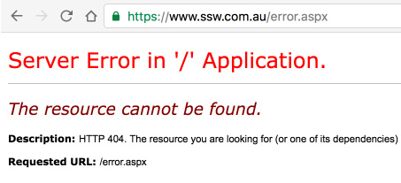

Error page, you say? You worked hard to make sure my site has no errors!! Well, surfers don't always type URLs accurately. No website is immune to such errors.

A well-designed custom error page encourages surfers to remain in your site and help them to the right page. Although it's possible to redirect error codes straight to your homepage, that doesn't tell visitors what's going on. It's more user-friendly to explain that there was a problem and provide some alternatives. Supply a link to your home page or other links, or offer your site's search function if you have one.


<!--endintro-->


```xml
<customErrors mode="Off"></customErrors>
```


::: bad
Figure: This is the default code on web.config 

:::


```xml
<customErrors mode="RemoteOnly" defaultRedirect="/ssw/ErrorPage.aspx">
<error statusCode="404" redirect="/ssw/SSWCustomError404.aspx">
</customErrors>
```


::: good
Figure: this is the current code in the web.config of the SSW Site  
:::

For ASP.NET website, the detailed information would be presented to the remote machines when an unhandled error occurs if the customErrors mode is off.

This error information is useful for the developer to do debugging. However, it would leak out some confidential information which could be used to get into your system by the hackers. We can assume that if a SQL exception occurs by accident, which may expose database sensitive information (e.g. connection string; SQL script). So, to prevent these leaks, you should set the "mode" attribute of the tag &lt;customerrors&gt; to "RemoteOnly" or "On" in the web.config file and create a user-friendly customized error page to replace the detailed error information.


```xml
<customErrors mode="RemoteOnly" defaultRedirect="GenericErrorPage.htm"></customErrors>
```


::: good
Figure: Turning on "customErrors" protects sensitive information against Hacker  
:::


::: bad  
  
:::


::: good  
  
:::

### Related rule

* [Do you avoid changing the URL on a 404 error?](/404-error-avoid-changing-the-url)
