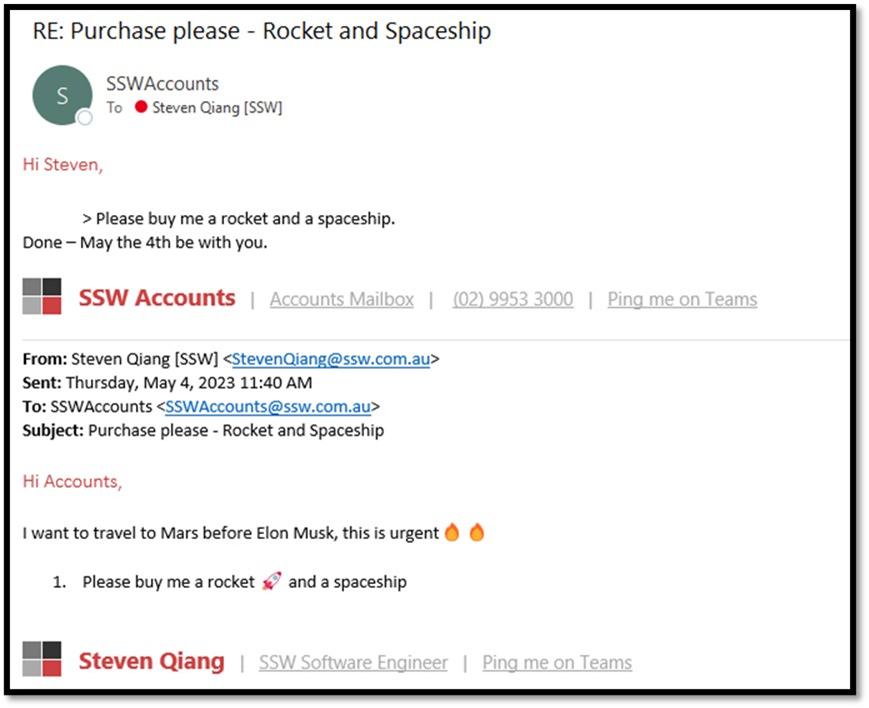
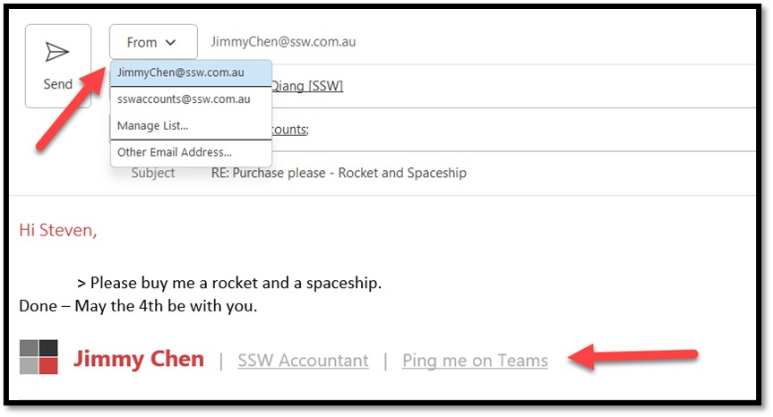
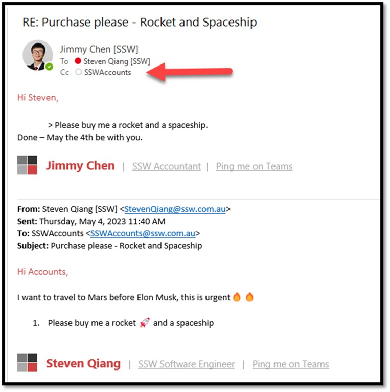

Sometimes staff may manage more than 1 email box - a personal email and a shared company email. It is important to maintain clear and consistent communication when managing multiple email accounts.

For internal communication, when you reply to emails from a shared company email account, the receivers may have little knowledge of who sent the emails. Which can lead to confusion and inconsistency in communication. To avoid these issues, we strongly recommend that staff avoid sending emails from shared company email accounts directly.

::: bad 
    
:::

When replying to emails from shared company accounts, you have an alternative:

1.	Switch the sender to your personal email account.
2.	CC the shared company email account on the reply to ensure that the thread is tracked.
3.	Make sure your signature is correct.

  At SSW, we use CodeTwo to automatically add our signatures.

::: good  

:::
