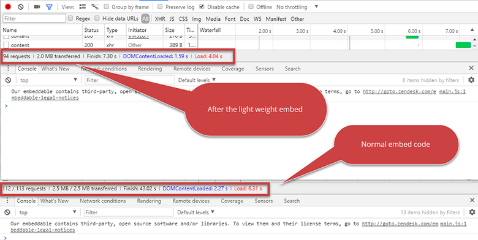
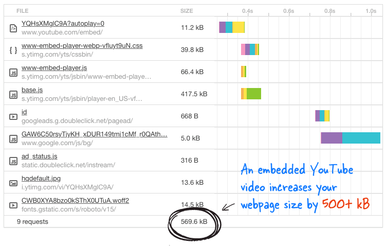

When you embed a YouTube video it will increase your page size from 500kbs to 1.5Mb or more, depending on how many videos are embedded on the page.  
 <excerpt class='endintro'></excerpt> 
<dl class="image"><dt>  </dt><dd>Figure: A side by side comparison – everyone wants less requests and a smaller page size</dd></dl><dl class="badImage"><dt> </dt> <dd>Figure: Bad example - Don’t add embed code directly from YouTube. For more details <a href="https://www.labnol.org/internet/light-youtube-embeds/27941/">read "A Better Method for Embedding YouTube Videos on your Website" </a></dd></dl>
&lt;iframe width="560" height="315" src="https://www.youtube.com/embed/eu0qhzevEXQ" frameborder="0" allowfullscreen&gt;&lt;/iframe&gt;
<dd class="ssw15-rteElement-FigureBad">Figure: Bad example – The evil HTML code</dd>  There is a clever, lightweight way to embed a YouTube video, which Google itself practices on their Google+ pages which reduce it to 15kbs. All you have to do is, whenever you need to embed a video to a page, add the below tag instead of the YouTube video embed code. (Remember to replace VIDEO_ID with actual ID of the YouTube video) 
&lt;div class="youtube-player" data-id="VIDEO_ID"&gt;&lt;/div&gt;
<dd class="ssw15-rteElement-FigureGood">Figure: Good example – The good HTML code</dd>  

<strong>Note: </strong>This script needs to be added at the end of the document:  

&lt;script&gt; /* Light YouTube Embeds by @labnol */ /* Web: http://labnol.org/?p=27941 */ document.addEventListener("DOMContentLoaded", function() { var div, n, v = document.getElementsByClassName("youtube-player"); for (n = 0; n &lt; v.length; n++) { div = document.createElement("div"); div.setAttribute("data-id", v[n].dataset.id); div.innerHTML = labnolThumb(v[n].dataset.id); div.onclick = labnolIframe; v[n].appendChild(div); } }); function labnolThumb(id) { var thumb = '&lt;img src="https://i.ytimg.com/vi/ID/hqdefault.jpg"&gt;', play = '&lt;div class="play"&gt;&lt;/div&gt;'; return thumb.replace("ID", id) + play; } function labnolIframe() { var iframe = document.createElement("iframe"); var embed = "https://www.youtube.com/embed/ID?autoplay=1"; iframe.setAttribute("src", embed.replace("ID", this.dataset.id)); iframe.setAttribute("frameborder", "0"); iframe.setAttribute("allowfullscreen", "1"); this.parentNode.replaceChild(iframe, this); } &lt;/script&gt;​ 

..and this needs to be added in the CSS:  

&lt;style&gt; .youtube-player { position: relative; padding-bottom: 56.23%; /* Use 75% for 4:3 videos */ height: 0; overflow: hidden; max-width: 100%; background: #000; margin: 5px; } .youtube-player iframe { position: absolute; top: 0; left: 0; width: 100%; height: 100%; z-index: 100; background: transparent; } .youtube-player img { bottom: 0; display: block; left: 0; margin: auto; max-width: 100%; width: 100%; position: absolute; right: 0; top: 0; border: none; height: auto; cursor: pointer; -webkit-transition: .4s all; -moz-transition: .4s all; transition: .4s all; } .youtube-player img:hover { -webkit-filter: brightness(75%); } .youtube-player .play { height: 72px; width: 72px; left: 50%; top: 50%; margin-left: -36px; margin-top: -36px; position: absolute; background: url("//i.imgur.com/TxzC70f.png") no-repeat; cursor: pointer; } &lt;/style&gt;

​ 

