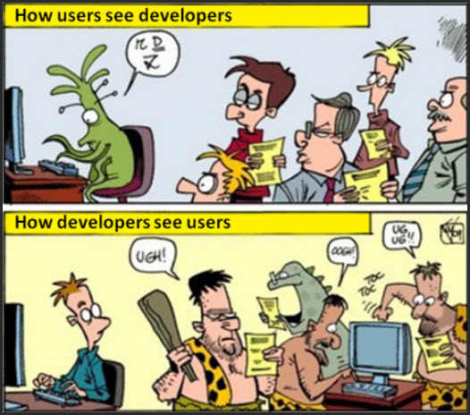
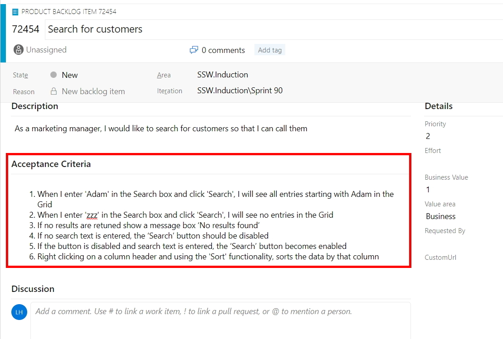

Never assume automatic Gold Plating. 

Most teams are getting the hang of User Stories that have subtasks. Unfortunately the same can’t be said about acceptance criteria. 
It is so important because real user stories tell a team when the task is done.

<!--endintro-->

Also, Product Owners should not get heartburn because ‘obvious’ functionality was not included. All requirements should be specified in the Acceptance Criteria.

For example, Product Owners should not assume things like:

* They will get a message that says ‘no records found’ or
* The grid will support features such as pagination or sorting

They must be specified in the Acceptance Criteria if required.

There are 2 parts to getting this right: The **Acceptance Criteria**, then the **Acceptance Tests**.

  

**Acceptance Criteria** (from the Product Owner) define the exact requirements that must be met for the story to be completed. They answer the question, "How will I know when I' m done with the story?"

  

::: greybox
When I enter ‘Adam’ in the search box and click 'Search' I will see all entries starting with 'Adam' in the grid.  
:::
::: bad
Figure: Bad Example of Acceptance Criteria - Incomplete 
:::

::: greybox
**Positive Test** -When I enter ‘Adam’ in the Search box and click ‘Search’ I will see all entries starting with Adam in the Grid
**Negative Test** - When I enter ‘zzz’ in the Search box and click ‘Search’ I will see \*no\* entries in the Grid
:::
::: ok
Figure: OK Example of Acceptance Criteria
:::

::: greybox
**Positive Test** - When I enter ‘Adam’ in the Search box and click ‘Search’ I will see all entries starting with Adam in the Grid   
**Negative Test** - When I enter ‘zzz’ in the Search box and click ‘Search’ I will see \*no\* entries in the Grid  
**Gold Plating** - If no results are retuned show a message box ‘No results found’  
**Gold Plating** – Validation: If no search text is entered, the ‘Search’ button should be disabled  
**Gold Plating** – Right-clicking on a column header should provide ‘Sort’ functionality  
**Gold Plating** – If a large set of results is returned, display pagination with page numbers and ‘Prev’, ‘Next’ links  
:::
::: good
Figure: Good Example of Acceptance Criteria – Including Gold Plating 
:::

::: greybox
For tiny User Stories, you can omit Acceptance Criteria. Sometimes you just need a **screenshot**, or even better a **video**.
:::
