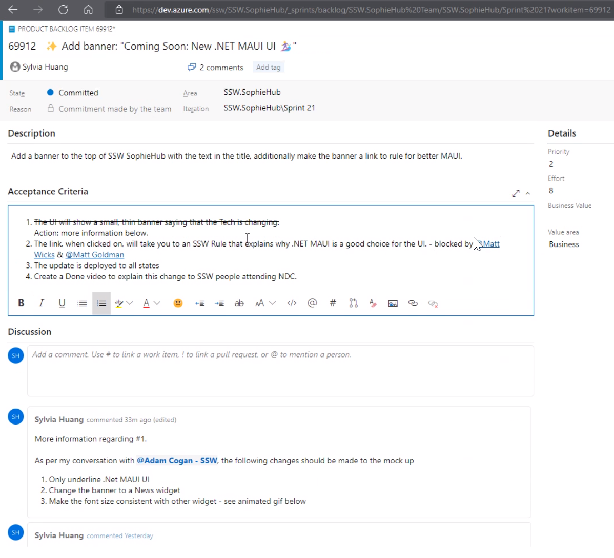

User Stories are a great way to capture requirements, but it can be difficult to work out when the implementation of a story is complete.

**Acceptance Criteria** (from the Product Owner) help to answer the question *"How will I know when I'm done with this User Story?".* It 
defines the exact requirements that must be met for the User Story to be completed.

<!--endintro-->

Acceptance Criteria are useful to every person who deals with a User Story. Developers know what they are required to implement and how their work will be tested. Testers have a basis for knowing what tests to create.

### What do good Acceptance Criteria look like?

Product Owners should make an effort to specify all of their requirements for a story in the Acceptance Criteria. For example, Product Owners should not assume things like:

* They will get a message that says ‘no records found’ or
* The grid will support features such as pagination or sorting

They must be specified in the Acceptance Criteria if required for the story to be considered complete.

::: greybox
When I enter ‘Adam’ in the search box and click 'Search' I will see all entries starting with 'Adam' in the grid
:::
::: bad
Figure: Bad example of Acceptance Criteria - Incomplete 
:::

::: greybox
* When I enter ‘Adam’ in the Search box and click ‘Search’ I will see all entries starting with Adam in the Grid
* When I enter ‘zzz’ in the Search box and click ‘Search’ I will see **no** entries in the Grid
:::
::: ok
Figure: OK example of Acceptance Criteria - However the Product Owner probably hasn't included all of their requirements
:::

::: greybox
* When I enter ‘Adam’ in the Search box and click ‘Search’ I will see all entries starting with Adam in the Grid
* When I enter ‘zzz’ in the Search box and click ‘Search’ I will see **no** entries in the Grid
* If no results are returned, show a message box ‘No results found’
* If no search text is entered, the ‘Search’ button should be disabled
* Right-clicking on a column header should provide ‘Sort’ functionality
* If a large set of results is returned, display pagination with page numbers and ‘Prev’, ‘Next’ links
:::
::: good
Figure: Good example of Acceptance Criteria
:::

::: info
**Note:** For tiny User Stories, you can omit Acceptance Criteria. Sometimes you just need a **screenshot** or, even better, a **video**.  
Be mindful that such small User Stories are the exception and not the rule when it comes to the need for Acceptance Criteria. 
:::

### Negotiating "gold plating"

Any requirements that the Product Owner considers "nice to have" - as opposed to being mandatory for the story to be considered complete - should be negotiated with development as early as possible. Developers can spend significant time working to meet acceptance criteria that the Product Owner is actually willing to sacrifice in the interests of quicker delivery.

::: info
**Tip:** Work closely with the Product Owner to identify potential "gold plating" in the story. Suggest creating a separate story for the functionality that is nice to have but has lower priority. Doing so allows developers to focus on building the most important functionality for the story first and prevents valuable time being wasted on gold plating.
:::

### Technical Acceptance Criteria
Sometimes, the team may discuss including technical requirements in Acceptance Criteria. Typically, technical Acceptance Criteria should be avoided. However, there are some situations where it makes sense, such as when:

* The team is trying out something new
* The team has been misaligned in the past, and the future direction needs to be clear
* The approach to take is complex or confusing
* An abnormal approach is being taken to avoid a specific issue (e.g. Reducing readability to improve performance for a particularly critical query)
* When the User Story is an Enabler (backlog items that extend the architectural runway of the solution under development or improve the performance of the development value stream)

If technical requirements are added, it should be a discussion between all of the developers in the team. If the Product Owner is technical, they are welcome to join the conversation, but they should not be the primary decision maker in this case.

Additionally, when adding technical requirements try to prefix with "Technical - " so their purpose is clear to everyone (e.g. "Technical - New CQRS Query made to get all employees")

### Acceptance Tests

Since Acceptance Criteria will be used to determine whether the work for the story is done or not, each of them needs to verified [using an Acceptance Test](/does-your-team-write-acceptance-tests-to-verify-acceptance-criteria).

It is good practice to make sure that each of the Acceptance Criteria is **testable** (e.g. Tests can be written to definitively determine whether the criteria has been met or not). This can help to reduce vagueness in the way Acceptance Criteria are defined.

::: info
**Note:** When all of the acceptance tests pass, the User Story  **might** be acceptable - but deeper testing would be required to be more certain. When any of the acceptance tests fail, though, we know for sure that the User Story isn’t acceptable. It can be helpful to think of "Acceptance Tests" instead as "Rejection Tests".
:::

### What's the difference between "Acceptance Criteria" and "Definition of Done"?

Acceptance Criteria help to answer the question *"How will I know when I'm done with this User Story?"*. **The Acceptance Criteria are different for each User Story**, provided by the Product Owner and used as a way to communicate to all involved that the requirements for a particular User Story have been met.

The [Definition of Done](/definition-of-done) is a structured list of items, each one used to validate a User Story, which exists to ensure that the team agrees about the quality of work they’re producing. It is defined by the team and serves as a checklist that is used to check each User Story for completeness. **The definition of "Done" is intended to be applicable to all items in the Product Backlog**, not just a single User Story. 

Examples of items in a Definition of Done that would **not** be part of Acceptance Criteria include:

* Code review completed
* Unit tests passed
* Code deployed to production

::: info 
The term "Definition of Done" is defined in the Scrum Guide, while "Acceptance Criteria" is not.
:::

### Capture changes to the PBI from discussions

The Acceptance Criteria are the source of truth for what functionality needs to be implemented for the PBI to be considered complete, so it's important to capture any changes to the PBI and the Acceptance Criteria (e.g. adding or removing "nice to have" aspects of the story). 

Any discussion that changes the story and/or the Acceptance Criteria should be noted in the Discussion section of the PBI for reference.

::: good

:::
