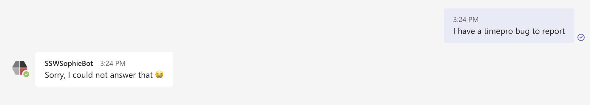

Sometimes when a user asks a question that bot doesn't know the answer to, they get an unhelpful response and no further options. Instead, it should give them some further options for how to find the information...

<!--endintro-->

::: bad

:::

::: good

:::