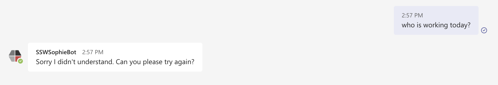

When the bot doesn't know the answer, it should give a nice generic answer if possible. People might find what they want in the extra information you provided.

<!--endintro-->

::: bad

:::

::: good

:::