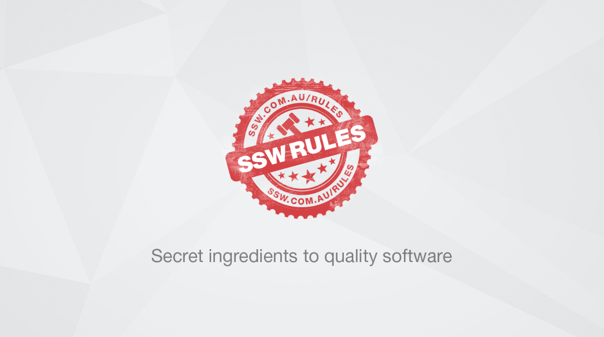

When there’s some key words that you really want people to notice, We can add a spot of color for the important word to create emphasis. 

<!--endintro-->

Make parts of the text different colors just like you’d highlight or boldface parts of a sentence. The duo colored text will help emphasize your message. Whenever possible use the brand colors when you do this.

