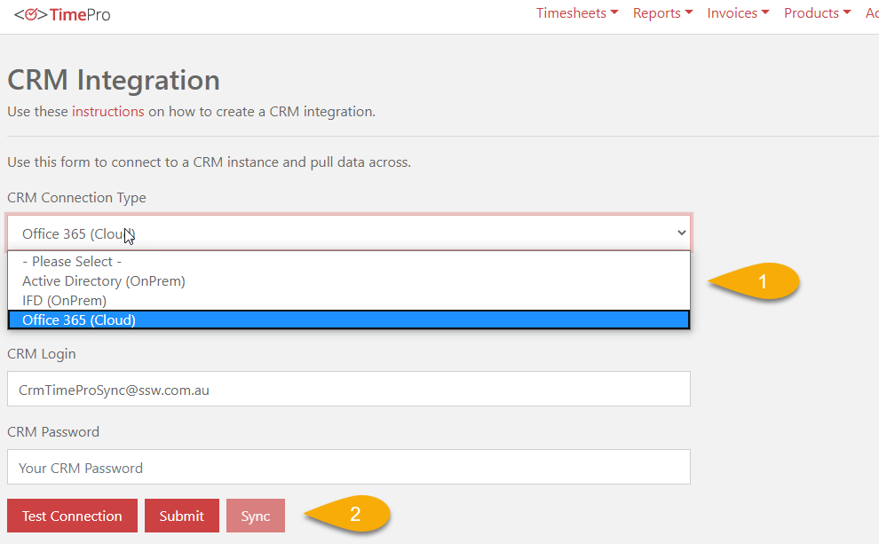
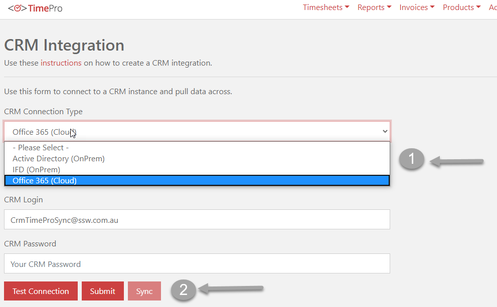
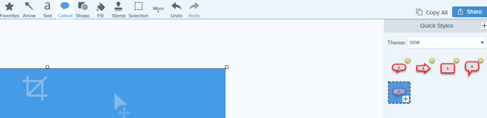

You can communicate better by using screenshots with balloons and other visual elements (arrows, shapes, and highlights) instead of only text. [Read the benefits of using screenshots](/screenshots-do-you-use-balloons-instead-of-a-wall-of-text).

We recommend you define a standard style for your visual elements by changing the default colors and shapes according to your branding.

<!--endintro-->

### More Information on SSW Branding

::: bad  
  
:::

::: good  
  
:::

  

Instructions to create and use Snagit themes can be found at [Quick Style Themes Tutorial](https://www.techsmith.com/tutorial-snagit-13-quick-style-themes.html).

::: greybox
 **Tip #1:** You can automatically have your SSW Snagit presets on sign-in via a script. See https://github.com/SSWConsulting/LoginScript.
 **Tip #2:** Save your images in PNG instead of JPG for better quality.
:::
