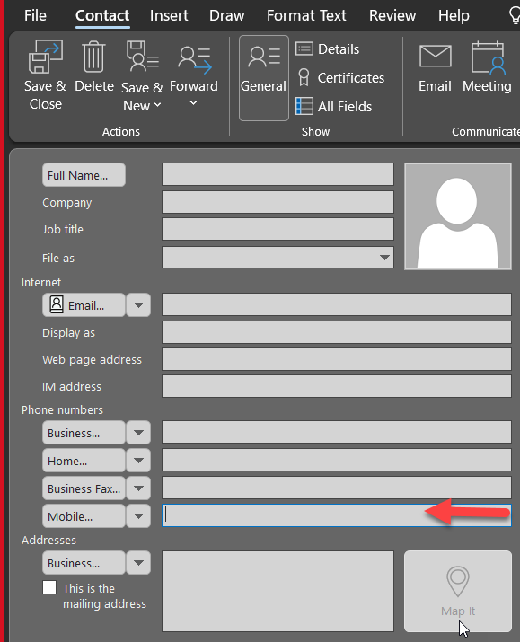
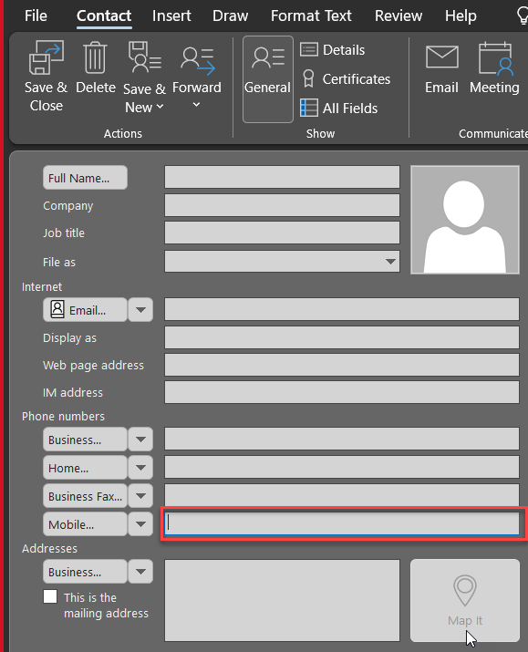
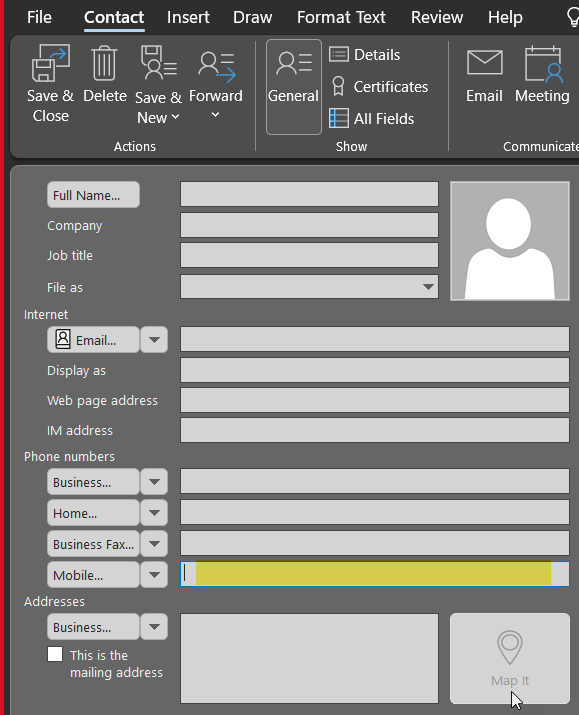

It is great when people use screenshots. You can communicate better by using screenshots with balloons and other visual elements (arrows, shapes, and highlights) instead of only text. [Read the benefits of using screenshots](/screenshots-do-you-use-balloons-instead-of-a-wall-of-text).

<!--endintro-->

We recommend you **define a standard style for your visual elements by changing the default colors and shapes according to your branding**.

See some examples of different visual elements under same branding:

### More Information on SSW Branding

You can automatically have the [SSW Snagit presets on sign-in via a script](https://github.com/SSWConsulting/SSWSysAdmins.LoginScript).

Instructions to create and use Snagit themes can be found at [Quick Style Themes Tutorial](https://www.techsmith.com/tutorial-snagit-13-quick-style-themes.html).
