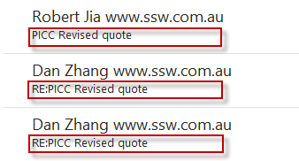

When discussing client work in an email, it is not always clear which client you are referring to. By using the ClientID as your email subject prefix, those involved in the email conversation will immediately know which client you are talking about.

<!--endintro-->

