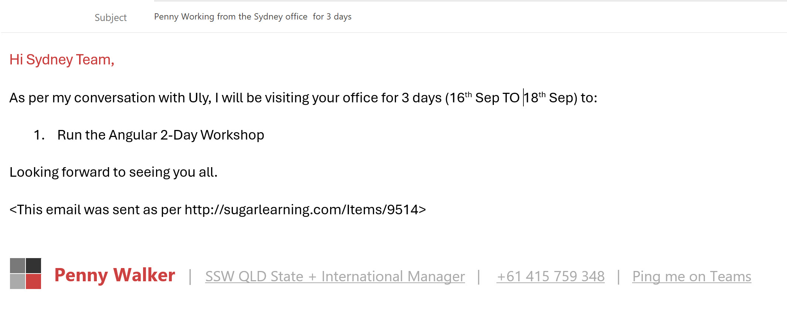
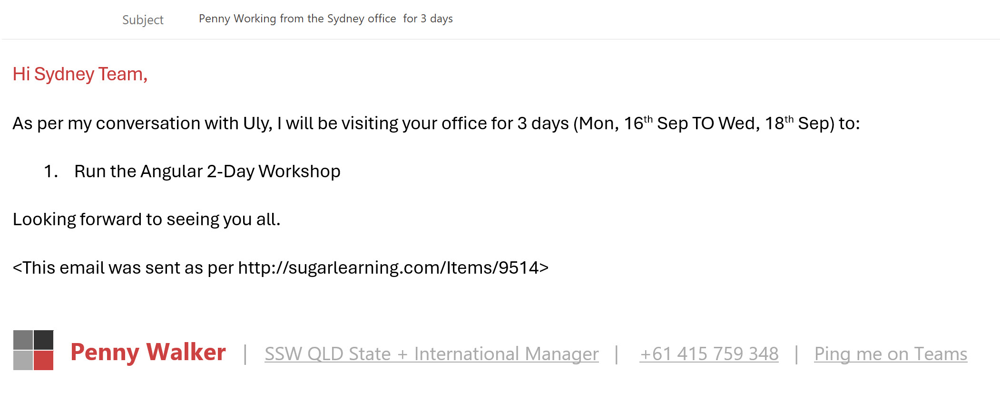

When you are planning on meeting someone or planning an event, it is very important that the date is extra clear.

<!--endintro-->

To ensure complete clarity, you should always include the day of the week alongside the date when it occurs. This will ensure there is no confusion, and everyone is on the same page.

::: bad

:::

::: good

:::
