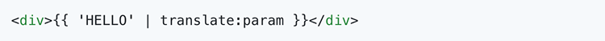
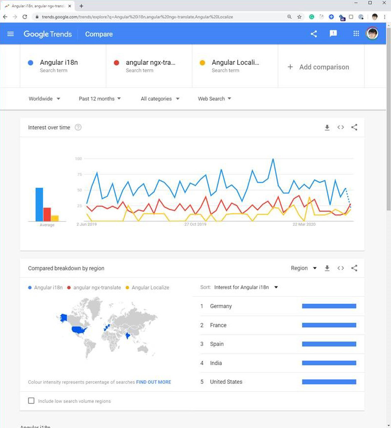

### How to implement multilingual support in an Angular project?

There are several ways of implementing multilingual support in an Angular project, the following libraries are popular:
 
 **[Internationalization (i18n)](https://angular.io/guide/i18n):** the standard Angular built-in module to help the application dealing with multilingual. It creates multiple language versions of your application.

 **[ngx-translate](http://www.ngx-translate.com/):** a library enhanced the Angular built-in feature, it supports not only template translations but can also be used in the code by APIs. 
 
 **[angular-gettext:](https://angular-gettext.rocketeer.be/)** the simplest powerful 3rd party library providing translation support to Angular.
 
The following table shows the pros and cons of the 3 libraries:

<!--endintro-->

| | **Pros (+)** | **Cons (-)** |
| --- | --- | --- |
| **Internationalization** **(i18n)** | <ul class="p3"><li>Better support of displaying dates,</li><li>Better support for handling plural forms of words, and alternative text. </li></ul> | <ul class="ul1"><li class="li2">It only works with one language at a time, you have to completely reload the application to change the language</li><li class="li2">Only support translation in the template (by using HTML tag)</li><li class="li2">You need to build + deploy every time you make a change to the language, and you have to have a separate folder every time.</li><li class="li2">You can see the language in the URL.</li></ul> |
| **ngx-translate** | <ul><li>It provides more powerful API support</li><li>It supports JSON files by default to store the translation resources</li></ul> | <ul class="ul1"><li class="li2">It doesn’t provide good support for plural forms and dates.</li><li class="li2">Ngx-translate will stop its releases when angular built-in modules catch up with the ngx-translate features.</li><li class="li2">The developer said that when Angular i18n catches up the library will be deprecated. Check <a href="https://github.com/ngx-translate/core/issues/495#issuecomment-291158036">article</a>.</li></ul>|
| **angular-** **gettext** | <ul><li>The simplest library to deal with multilingual.</li><li>Supports plural handling in different languages.</li></ul>| <ul class="ul1" style="text-decoration:line-through;"><li class="li2" style="text-decoration:line-through;">It compiles the translations during the compiling period, which doesn’t support the change of translation at any time.</li><li class="li2" style="text-decoration:line-through;">Only supports AngularJS</li></ul> |

**Ngx-translate** provides the APIs which you can use to translate the resources in the code:

By comparing the 3 libraries we can see      **ngx-translate** provides the best functionality now due to the API support, even though the built-in i18n module will catch up at a certain time, but we still recommend using      **ngx-translate** for multilingual support in your Angular application.

### The future…

Since Angular 9, they now have built-in support for i18n which is called Angular Localized, it is expected that over time, Angular Localize will become the most popular (see the yellow line on     [Google Trends increase](https://trends.google.com/trends/explore?q=Angular%20i18n%2cangular%20ngx-translate%2cAngular%20Localize)).

