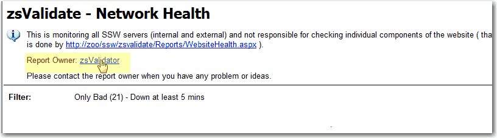
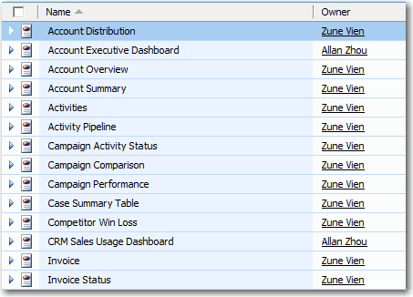

Report owner is the person who looks after this report. It's a good way to put the owner on the report in order to get any response or suggestion on time.

<!--endintro-->

There are four things you have to take care of.

1. Please make sure you use a group (or a team) as the report owner rather than individual names. We do this to reduce maintenance work - whenever a person comes or leaves we do not need to modify the report.

2. Make the report owner a hyperlink which links to the definition of the group (or the team).

::: good  

:::

3. When you cannot refer to a group, refer to the person
Use the same idea for web pages, however in that case use the term "Page Owner"

4. In CRM, the report can read from the CRM database since the report owner is stored by CRM against the report:

::: good  

:::
