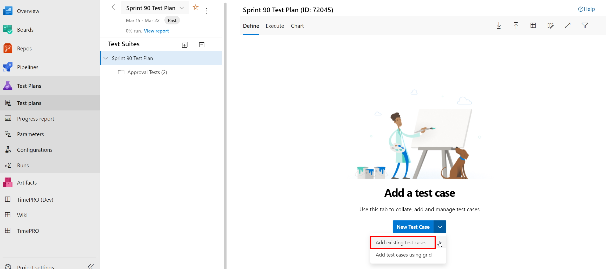
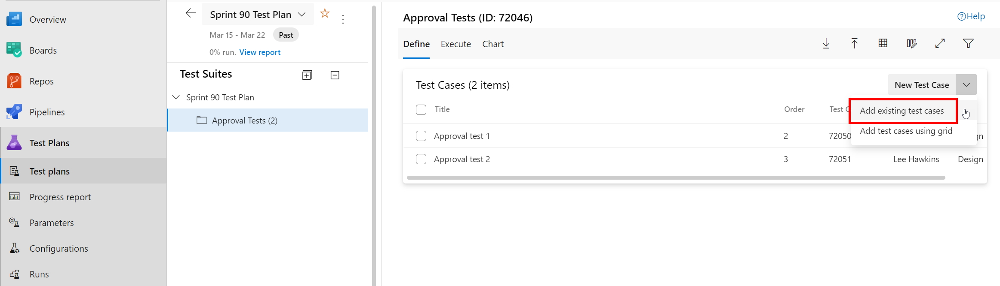

Organize your Test Cases by adding them to a Test Plan or Test Suite. 
One Test Plan per Sprint is recommended.

A Test Plan consists of a number of Test Suites and/or Test Cases.

<!--endintro-->

To add Test Cases to a Test Plan, select the required Test Plan and then click on the down arrow against "New Test Case" and "Add existing test cases":

To add Test Cases to a Test Suite within a Test Plan, click on the down arrow against "New Test Case" and "Add existing test cases":

