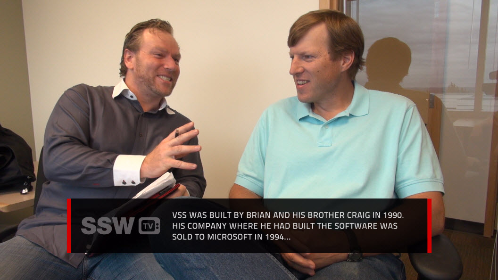
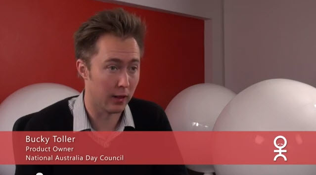

Adding text to videos (refer to any text pop-up on screen as a 'caption') can be a powerful way to reinforce the content and make it more engaging and accessible for viewers.

<!--endintro-->

## Benefits

Here are some key points on why and how to effectively use text in videos:

### Emphasize key points

* **Highlighting important information:** Text can be used to draw attention to critical pieces of information, ensuring that viewers don't miss the most important parts of your message
* **Reinforcement of spoken words:** By displaying key phrases or concepts as they are spoken, you help reinforce the message and make it more memorable

### Enhance accessibility

* **Subtitles and Captions:** Adding subtitles or captions ensures that your content is accessible to a broader audience, including those who are hearing impaired or watching without sound. E.g. someone's name, a job title, or date/location
* **Multi-language Support:** Text can also be translated into multiple languages, allowing your video to reach a global audience

### Improve engagement

* **Visual appeal:** Well-designed text can add a dynamic visual element to your video, making it more engaging and professional-looking
* **Viewer interaction:** Text prompts, questions, or calls to action can encourage viewers to interact with your content, increasing engagement

### Clarify complex information

* **Simplifying concepts:** When discussing complex topics, breaking them down into text-based bullet points or summaries can help viewers understand and retain the information
* **Diagrams and annotations:** Text can be used alongside diagrams, charts, or images to provide clear explanations and context

### Guide the Viewer’s Attention

* **Directing focus:** Text can be used to guide viewers' attention to specific parts of the screen or specific elements within the video
* **Step-by-step instructions:** In instructional or tutorial videos, on-screen text can guide viewers through each step, making the process easier to follow
  
### Branding and Consistency

* **Branding elements:** Incorporating your brand's colors, fonts, and logos in the text can reinforce brand identity and create a cohesive look
* **Consistency:** Consistent use of text across your videos helps in maintaining a professional appearance and strengthens brand recognition

## Tips for effective use of text in videos

* **Keep it concise:** Avoid overcrowding the screen with too much text. Stick to short, impactful phrases
* **Readability is key:** Use clear, legible fonts and ensure the text contrasts well with the background
* **Timing Matters:** Sync the text with relevant audio or visuals to ensure it enhances rather than distracts from the content
* **Placement:** Position text in areas that don’t obscure important visuals but are still easily noticeable

::: bad  
  
:::

::: good  
  
:::

Now you cant really have just one type of caption. Have defined styles for different types of videos.

E.g. Here are the styles SSW use for their videos:

::: good  
  
:::

::: good  
  
:::

::: good  
  
:::

::: good  
  
:::

Remember to put any links that you've mentioned in the captions underneath your video in it's own section (with a heading such as 'Show Notes' or 'Related Content'). You can also use this section to put in links that are related to what was said in the video as evidence (similar to footnotes or a bibliography in a book). That way, you will gain more Google juice and it will make it easier for the Product Owner to review your captions.

Incorporating text into your videos can significantly enhance the viewing experience, making your content more engaging, accessible, and memorable for your audience.
