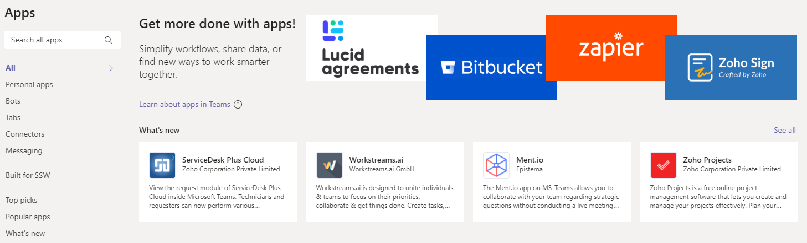
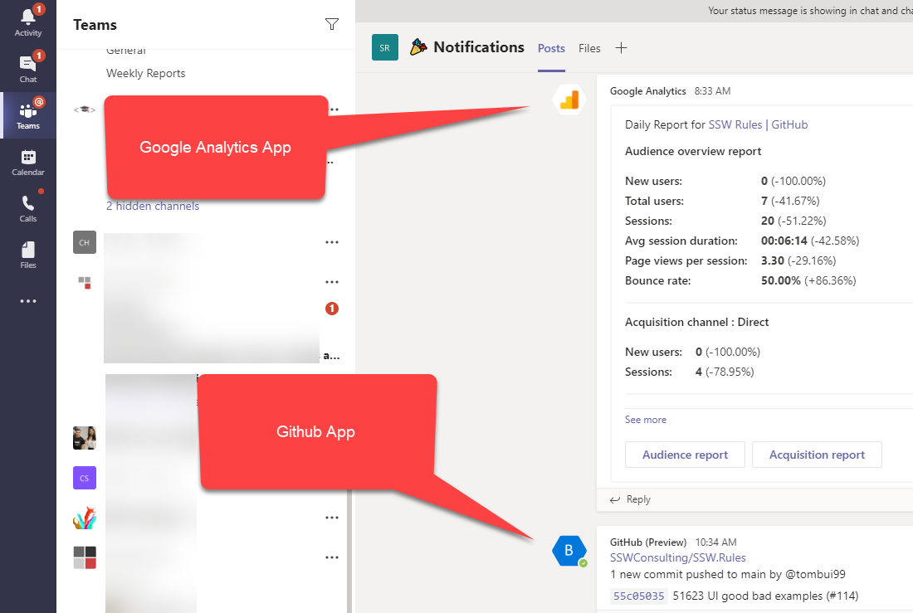

​When creating a new Team in Microsoft Teams, you can add Tabs to keep track of important information and you can also add Apps (generally bots) to channels. 

 <excerpt class='endintro'></excerpt> 

Apps enhance your Teams experience in various ways e.g.:​ 

<ol><li>Apps can be bots, and you can talk and interact with them</li><li>Apps can add and change your messages in Teams</li><li>Apps can also be Tabs, they overlap a little </li></ol>
You can also read more about Apps at <a href="https://support.microsoft.com/en-us/office/five-things-to-know-about-apps-in-microsoft-teams-747492ee-7cdd-4115-a993-8c7e7f98a3d0">Five things to know about apps in Microsoft Teams</a>.
<dl class="image"><dt></dt><dd>Figure: There are various apps you can add to channels</dd></dl><dl class="image"><dt></dt><dd>Figure: Apps for Google Analytics and GitHub in a channel</dd></dl>​ 

