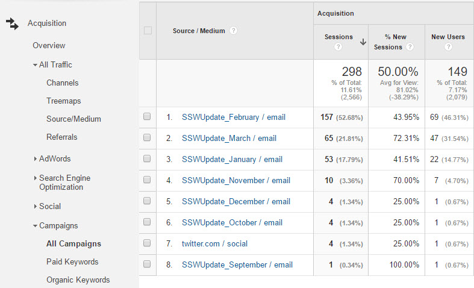

Understanding  and taking  advantage of tracking codes on URLs is very important to working out where to spend your SEO efforts and $$$. 

What is the difference in these 2 URLs?

 **[https://www.thetrackr.com](https://www.thetrackr.com/)** 
Vs
 **[https://www.thetrackr.com/bravo?utm\_expid=98763450-11.FrU2vkRZTECb\_wLuT78JGA.1&utm\_source=facebookads&utm\_medium=conversions&utm\_campaign=AU\_English\_BravoOrderSuccess4LAL\_AgeTargets&utm\_referrer=http%3A%2F%2Fm.facebook.com#ab\_test=b](https://www.thetrackr.com/bravo?utm_expid=98763450-11.FrU2vkRZTECb_wLuT78JGA.1&utm_source=facebookads&utm_medium=conversions&utm_campaign=AU_English_BravoOrderSuccess4LAL_AgeTargets&utm_referrer=http://m.facebook.com#ab_test=b)** 

<!--endintro-->

With the second URL you will get reports like this:

 **Figure: The page owner will find out how people are getting to their page.** 
This enables the page owner to find out how visitors are finding the page. For example, if they're advertising ProductX on Google, and on Facebook, and in email blasts, all linking to the same page, they can customise the links from each of these pages with a unique tracking code. This code will identify the traffic that comes from that source, along with other useful information like which advertising campaign the traffic came from.

With the long URL, there's a lot of additional information that can be taken from the link:

[https://www.thetrackr.com/bravo?utm\_expid=98763450-11.FrU2vkRZTECb\_wLuT78JGA.1&utm\_source=facebookads&utm\_medium=conversions&utm\_campaign=AU\_English\_BravoOrderSuccess4LAL\_AgeTargets&utm\_referrer=http%3A%2F%2Fm.facebook.com#ab\_test=b](https://www.thetrackr.com/bravo?utm_expid=98763450-11.FrU2vkRZTECb_wLuT78JGA.1&utm_source=facebookads&utm_medium=conversions&utm_campaign=AU_English_BravoOrderSuccess4LAL_AgeTargets&utm_referrer=http://m.facebook.com#ab_test=b)

utm - An Urchin Traffic Module (UTM) code is the way that businesses track sales from their origination point (like a tweet, email or a brochure) down the funnel to their conversion page.

expid – short for 'experiment id' , it relates to using Google Experiments, which is a way of testing different versions of pages to see which one converts the best

source - The source is where your link is hosted, like search, affiliate website or email campaign name or anywhere else.

medium – used to identify the medium the link was used upon such as: email, CPC, or other method of sharing.

campaign  - The medium is how it's delivered, like a postcard, PPC, email or social media. The campaign is typically what you're promoting, or the special way you're promoting it (like a holiday sale).

Referrer – this relates to the "expid" code earlier in the URL – it shows which variant of the a/b testing you were referred from (in this case, it is the "b" version of the experiment)
