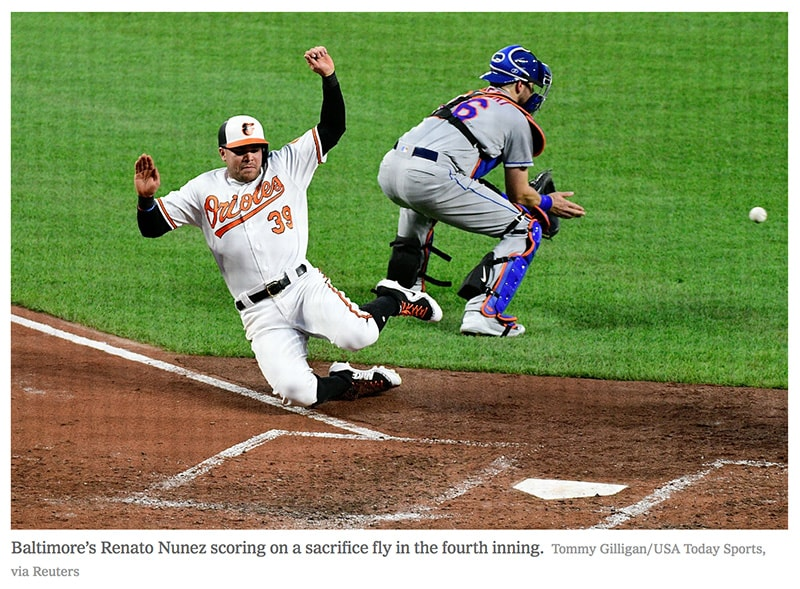

When you add an image to a website or application, it is so useful to add a figure underneath it to describe your image. 

It's the best way of ensuring you catch users' attention to the content of your page. When you're scanning a newspaper for interesting articles, you'll check out the pictures, read the accompanying description, and if it sounds interesting you'll go back and read the article.

<!--endintro-->

Users read websites in a similar fashion. Catch their attention with an image, and then keep it with a useful description. Don't just describe what the image is; say what it's used for in the context of the document.

::: info
**Tip:** Prefix it with the actual word "Figure: ".
:::

::: good  
  
:::

It is especially important that images and captions serve a purpose, as opposed to graphics which are there solely for design.

### Tip #1 - Give bad and good examples 

When possible, use "bad" and "good" examples to clearly explain **Dos and don'ts**.
At SSW we always show the bad example first, then the good example. You will see samples of this in the next tips below.

### Tip #2 - Bold your captions

::: greybox
[image]   
\[Description...\]
:::
::: bad
Figure: Caption not bolded
:::

::: greybox
[image]   
**\[Description...\]**
:::
::: good
Figure: Caption is bolded
:::

### Tip #3 - Describe the actions in your captions

Especially for screenshots, it is a good idea to have your figure describe the action the user would take:

::: greybox
\[image\]   
**Figure: This is the screen**
:::
::: bad
Figure: Bad example - Vague caption description 
:::

::: greybox
\[image\]   
**Figure: On the screen, choose the execution method**
:::
::: good
Figure: Good example - Clear caption description
:::

### Tip #4 - Add titles for videos

When embedding videos from others, include the video title as the caption. This helps:
- Giving a brief text explanation of the video
- Getting some extra Google Juice
- Serving as a reminder in case that video ever gets removed by its owner

If you have them, prefix with "Video: \[Title\] " instead of "Figure: ".

::: info
**Note:** The exception is for promotional videos where the caption may impact the nice look and feel of your page.
:::

::: greybox
\[video\]   
**Figure: In this video, Gary talks about how to search on Outlook**
:::
::: bad
Figure: Bad example - Using "Figure:" for a video caption
:::

::: greybox
\[video\]   
**Video: How to search on Outlook by Gary**
:::
::: good
Figure: Good example - Using "Video: \[Title\]" for a video caption
:::
