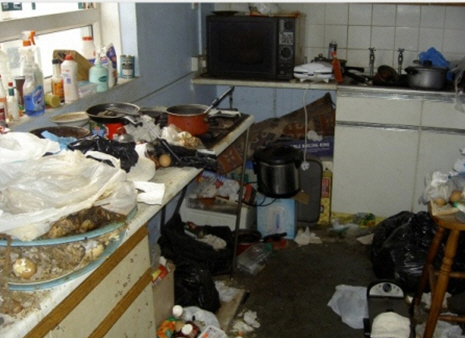

​Too many people treat Source Control as a networked drive. Don't just check-in when the clock ticks past 5 or 6 o'clock. If code doesn't pass its unit tests or won't even compile put your code in a <a shape="rect" href="http://msdn.microsoft.com/en-us/library/ms181403.aspx">shelveset</a>.​ 

 <excerpt class='endintro'></excerpt> 
<dl class="image"><dt></dt><dd>Figure: Put your dishes straight in the dishwasher otherwise you leave a mess for others (aka "Check-in" the right way otherwise you give other developers problems)</dd></dl>
 Other recommendations have included using //TODO or commenting the code out. However, we recommend avoiding this practice as it increases the risk that the code is forgotten about.​​ 

 <b>Note:</b> Having 
   <a shape="rect" href="http://www.ssw.com.au/ssw/Standards/Rules/RulesToBetterVersionControlwithTFS%28AKASourceControl%29.aspx#MinimumBuilds">gated check-ins </a>will help prevent this from happening.​ 

 <b>Note: </b>A useful tool is 
   <a shape="rect" href="https://marketplace.visualstudio.com/items?itemName=Vercellone.TFSAutoShelveforVisualStudio2017">TFS Auto Shelve </a>- Protect your code by guaranteeing your pending changes are always backed up to the TFS server. 

