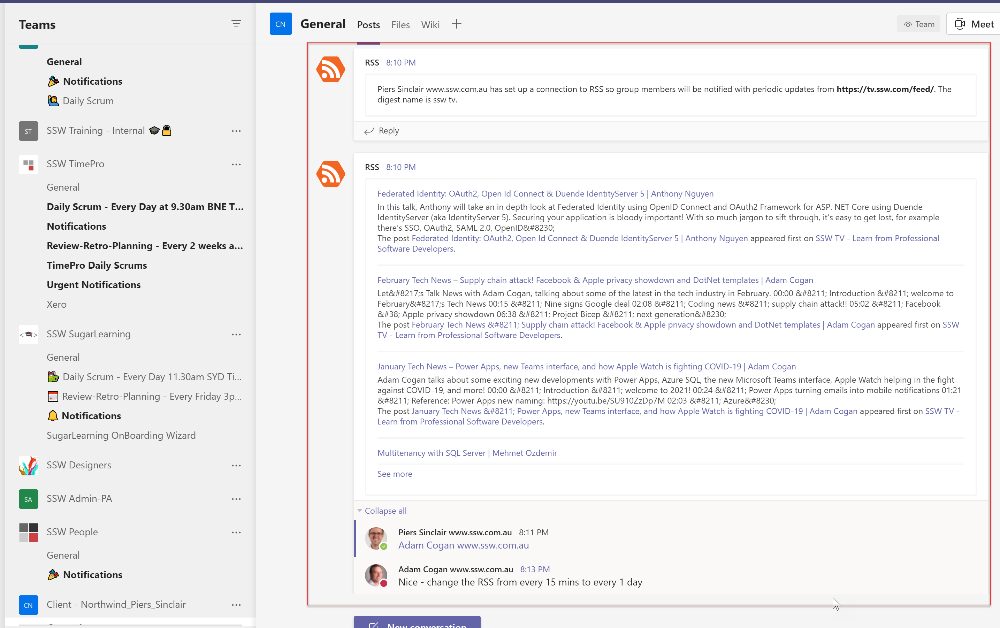

Testing is a vital part of any development and can be quite time consuming, depending on the complexity of the application. 
<!--endintro-->
 You can reduce the project costs by a substantial margin if you are willing to come onsite and help out with testing yourself. After all, as the Product Owner, you are the one with the best knowledge of the desired functionality for the system

Twitter embed

`oembed: https://twitter.com/MrHinsh/status/24123713864`

Facebook embed

