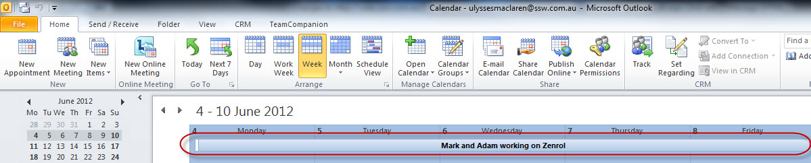

Unless we're currently working on the last sprint of the development, you should always book the next sprint as soon as you start work on the current one. 

<!--endintro-->

Hagas

This is done during the [planning meeting](/do-you-know-what-happens-at-a-sprint-planning-meeting) and will ensure the availability of the developers who are up to speed on your project and stop them from being booked onto something else.

