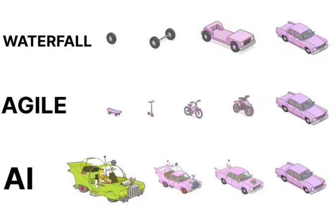

"Vibe coding" is a trend that has taken the software development world by storm recently.

It means developing via a coding agent, and never even looking at - let alone editing - the code. It has also become synonymous with low-quality code.

Of course there is a time and a place for it e.g. building a rapid prototype, or working with a tight budget. See how SSW empowers non-developers with the tools to start vibe coding [here](https://www.ssw.com.au/consulting/vibe-coding).

When writing code as a professional developer, "vibe coding" may make it easy to get a solution up and running without worrying about the details, but as soon as you commit it to the repository under your name, it becomes your responsibility, as if you had written it yourself.

Hence it can be tempting to just "vibe" your way through a few features, but if you do not understand what it does and why, you are going to get into trouble if bugs start popping up.

There are some best practices to follow when doing AI assisted development to avoid problems down the track without missing out on the efficiency gains of AI tools.

<!--endintro-->

`youtube: https://www.youtube.com/watch?v=-ke-TkGu9Ng`
**Video - AI Assisted Development for Enterprise | Calum Simpson | SSW Rules (13 min)**

## Workflow: Plan → Discuss → Implement → Review

There are likely millions of ways to implement any given feature in a software project. Most of them are going to be bad and should be discarded out of hand... even though they may "work".

There will probably be a handful of good solutions to pick from. Picking the right way to solve the problem given the whole context of the surrounding codebase, project architecture, Product Owner requirements, current or upcoming tech changes, etc. is usually what separates the best developers from the rest.

Even an AI that writes perfect code is going to do a bad job if the code it is trying to write does something that makes no sense in the context of the project. And most AI agents (at least for now) have no way of accessing a lot of that contextual information - especially if it is outside the current repository.

::: bad

:::

Therefore the professional AI Assisted Developer should follow a proper workflow with every feature implemented. Instead of just typing: "Implement my feature XXX", hitting enter, and walking off to brew a coffee, here's the recommended workflow:

### 1. Plan

Before doing anything, plan what you are doing. Give the AI your requirements and as much related context as possible. If you are using an AI that can search the web, ask it to go have a look for any relevant documentation, best practices, potential pitfalls, code snippets or repos, etc.

Ask it to produce a markdown file containing a detailed step-by-step plan to implement the feature - including which files will be added or created, and what high-level changes will be made in each, and reference URLs. Ask for each step of the plan to be a small self contained unit of work (or as small as possible) to make implementation easier later.

### 2. Discuss

This is where the professional developer shines. You now have a detailed plan in a markdown file telling you exactly what needs to be done - it is your job to ensure that you not only understand everything it is going to do - but also that what it is proposing makes sense in the wider context of the project.

The file should be a living document, which you can either manually edit as required, or discuss with the AI agent and ask it to edit.

### 3. Implement

Okay - now that all the planning and discussing is done and your planning document updated - ask the agent to implement the first (or next) step of the plan. **Now** you can go enjoy that coffee break.

Importantly, the scope of what the agent is working on will be limited by each step being a small self-contained unit of work. It may be wise to instruct your agent to strictly follow the listed instructions and not to do anything extra - depending on how overzealous it is.

### 4. Review

This is the most important step in AI assisted development. Once you accept a piece of code that the AI suggests to you, it is no longer the AI's responsibility. Your name will be on the commit, so it's **your responsibility**. Ensure you completely understand everything it has done, as if you were reviewing someone else's pull request. If you have any questions, just ask the agent - you may learn something new or help uncover a bug.

If you have some unit tests, it probably makes sense to run them every time you are reviewing an agent-implemented step. The sooner you catch a bug, the better.

Once the review step is complete and you are happy with the code, you can commit it to your feature branch, update the step-by-step plan to say which steps are done (manually or via the agent), then optionally return to the Plan phase if things have changed, or to the Implement phase if you are ready to proceed straight to the next step.

- - -

::: info
**Tip:** Use [Cursor Rules](https://docs.cursor.com/context/rules) to define this and other behavior without having to repeat it every time.
:::

::: info
**Tip:** Use [GitHub Copilot](https://docs.github.com/en/copilot/using-github-copilot/code-review/using-copilot-code-review) to help review the code before you merge it in. Note this does not remove the need for you to understand it, but it may offer an additional perspective.
:::
