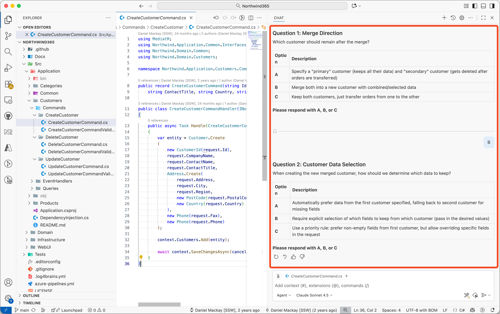

When interacting with AI, clarifying questions are inevitable. The difference between slow, meandering threads and fast, decisive progress is how those clarifications are framed. You should train your AI assistant to present clarifying questions as **labelled option tables** instead of open-ended text. This reduces friction, lowers cognitive load, and allows quick responses to AI.

Instead of forcing the human to invent an answer, the AI does the thinking upfront: it proposes plausible choices (A, B, C) and asks for a single-letter response (optionally with a tweak). The human can: pick one, pick + adjust, or reject and explain. All are faster than crafting a reply from scratch.

::: bad
Developer / AI agent asks:

> Where should the new command go?

Dev has to remember folder conventions, naming, and side‑effects.
:::

::: good
Developer / AI agent asks with labelled options (Northwind-flavoured example):

> Where should the UpdateCustomerCreditLimitCommand live?

| Option | Location | Rationale |
|--------|----------|-----------|
| A | Features/Customers/Commands/ | High cohesion: grouped with other customer behaviours |
| B | Features/Accounting/Commands/ | Treats credit limit as a financial control concern |
| C | Other (please specify) | Invite a better bounded-context suggestion |

Chosen: **A** – one letter, instant alignment.
:::

<!--endintro-->

::: bad

:::

::: good

:::

## Why this works

* Reduces ambiguity – each option is a concrete, pre-vetted path.
* Encourages fast, high-signal replies ("A" instead of a paragraph).

---

## Fix your prompt

Add this to your system prompt or instructions:

::: info
Whenever you need clarification, do NOT ask open-ended questions. Instead, produce a table of 2–4 labelled options (A, B, C …) so its easy for me to choose.
Ask questions one at a time.
:::
