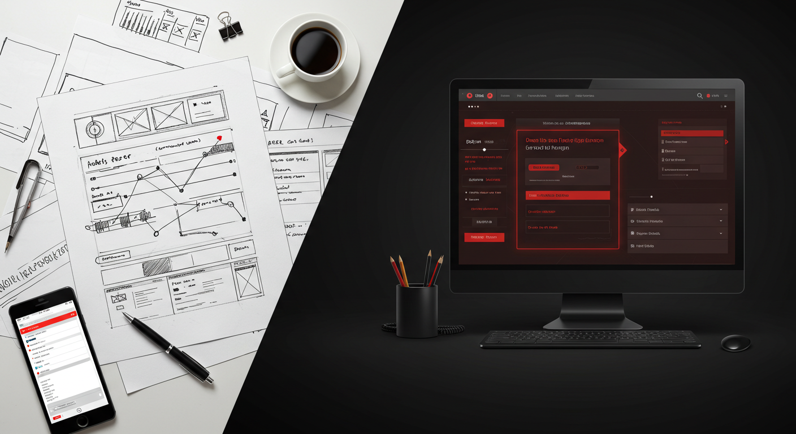
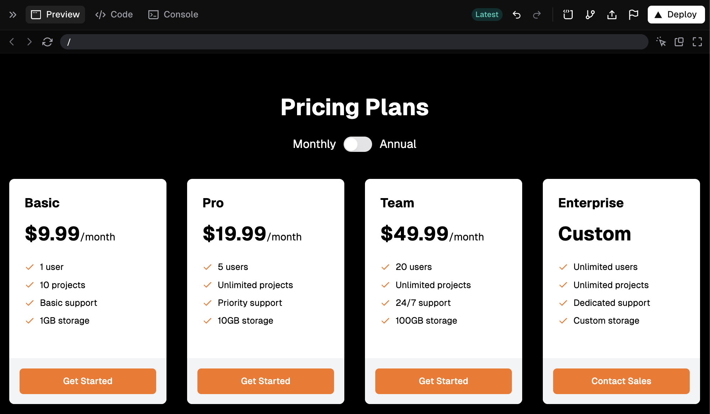

AI is transforming frontend development by enabling faster delivery of code and making web development more accessible. From prototyping visuals, generating and deploying entire sites, to generating boilerplate code – the right AI tools can  enhance your productivity and fill gaps in your skillset.

<!--endintro-->

## Tooling Options

Here is a comparison of AI code generation tools:

| Best use case                | Tool                                     | Details                                                                                  | Integrations and source options                        |
| ---------------------------- | ---------------------------------------- | ---------------------------------------------------------------------------------------- | ------------------------------------------------------ |
| Interactivity and Deployment | **[v0](https://v0.dev)** ✨ (Recommended) | Utilizes shad-cn/ui. Integrated deployment with Vercel.                                  | Prompts, images (screenshots, sketches, or via Figma). |
| Responsive Design            | **[Lovable](https://lovable.dev)**       | From desktop to mobile, and full-stack applications.                                     | Prompts, images, or via Figma.                         |
| Non-React Frameworks         | **[Bolt.new](https://bolt.new)**         | Terminal access via playground for specific run commands. Integrated deployment options. | Prompt or image.                                       |
| Pixel-accurate Code          | **[Anima](https://www.animaapp.com)**    | Near pixel-accurate code (React, HTML, CSS) based on design tooling integrations.        | Figma, Sketch, or other design tooling via plug-ins.   |
| Quick Page Designs           | **[Uizard](https://uizard.io)**          | Pseudo-designer for creating a set of page designs, with code export options.            | Prompt or screenshot.                                  |

:::info
These tools keep getting better - what they can do changes quickly.
:::

## When and how to use these tools

### Prototyping and proof of concepts

Non-technical team members can easily create functional prototypes using screenshots, hand-drawn wireframes, or other source materials. These prototypes allow for early experimentation with interactive site instances, helping teams align on design and functionality without needing extensive technical expertise.

Development teams can take advantage of these tools to generate a front-end proof of concept in minutes, showcasing interactive components or layouts and iterating on designs rapidly based on real-time feedback.

### Starting a project

Using an AI-generated website as a launching point can save you hours of development time. These tools allow developers to quickly generate boilerplate code, create an initial set of reusable components, and even set up design-consistent layouts. In turning static assets into fully functional prototypes, you can reduce the time spent on initial setup tasks and focus on more complex features.

### Ideation to deployment

Tools like v0 and Bolt.new let non-technical users take a project from idea to deployment. A team member can turn wireframes, sketches, or Figma files into functional prototypes and deploy them using hosting services like Vercel. This allows stakeholders to interact with live prototypes, provide quick feedback, and iterate collaboratively. The process bridges the gap between design and deployment, speeding up validation and improving teamwork.

`youtube: https://www.youtube.com/embed/cyFVtaLy-bA?si=7jPOmb3MoZ1SPGzt`

### Custom components

AI tools make it easy to replicate components from reference websites with minimal effort. Tools like V0 or Anima can analyze and recreate elements like navigation bars, buttons, or card layouts based on inspiration sites. These tools generate the code as a starting point, which you can refine to match your project.

You’ll need to integrate the component into your architecture, ensure it aligns with your design system, and fine-tune styles or interactions to match branding and accessibility requirements.

## ⚠️ Caveats

These are powerful tools, but still have some caveats you should keep in mind if you choose to take advantage of them.

### Lack of context awareness

AI tools often lack the full context of your project, which can complicate integration. An [AI-powered IDE](https://www.ssw.com.au/rules/best-ai-powered-ide/) may be more effective if knowledge of your website is crucial.

### Quality

Converting designs may not always result in pixel-perfect outcomes. Complex UIs or animation heavy components are still a challenge. Be prepared for manual adjustments.

### Security

AI tools trained on public datasets might introduce biased patterns or insecure code. Properly audit any generated code for enterprise use.

## Example of prompt and the result

::: greybox
I need a pricing page with 4 options in columns ending with enterprise.\
I would like a toggle at the top to change from monthly to annual.\
I would like it in orange, black and white.
:::

