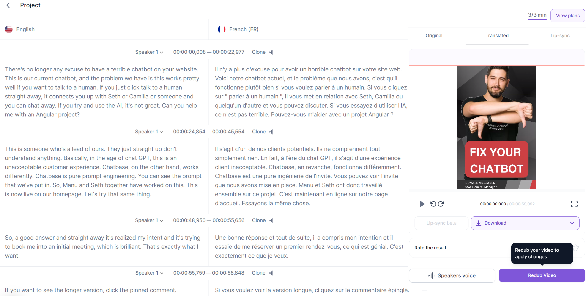
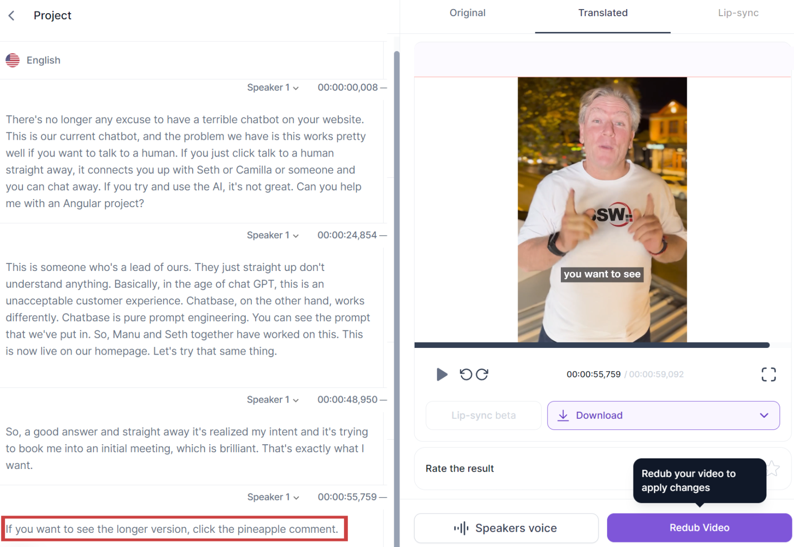

AI tools like[ Rask](https://app.rask.ai/auth), [Voice.ai](https://voice.ai/home), and [ElevenLabs](https://elevenlabs.io) are revolutionizing how we generate voices and translations. They can even create transcripts, making our lives a lot easier. But remember, with great power comes great responsibility! 🦸‍♂️

<!--endintro-->

::: good

Video -  [Fix Your Website Chatbot! - English version](https://youtube.com/shorts/vSXy1VjS_b4)

Video -  [Fix Your Website Chatbot! - French translation](https://youtube.com/shorts/NxhP6YyBEk8)

:::

## The Need for Oversight 👀

While these tools are incredibly helpful, they're not perfect. It's important to double-check their output to ensure accuracy. After all, we wouldn't want any miscommunication, would we? 🙅‍♂️

::: bad

:::

## The Ever-Changing AI Landscape 🌅

The AI landscape is constantly changing and improving. Today's best tool might be tomorrow's old news. So, keep an open mind and be ready to adapt to the latest and greatest! 🔄