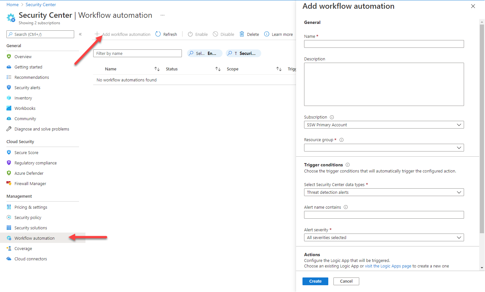

Once your environment is secured sufficiently you need to configure some alerting.
This will ensure that any changes either due to changes in your Azure deployment or more importantly improved scanning in Security Center result in you being alerted so that your infrastructure can be better secured.

<!--endintro-->

You can then set up the Action to notify you. There're all sorts of filtering functionality as well. 

Set up alerting on at least the Security Center recommendations and Threat Detection alerts. If you need to comply with a regulatory framework, then it's important to add an alert for that too (this is the 3rd of the Security Center data types), so that you can avoid compliance failures.