Just as barcodes allow machines to read data from items in stores, QR codes are a barcode-like vector between online and offline information. QR codes can be easily accessed by any phone in the world that has a camera. They enable everything from online to offline (O2O) marketplaces, the latter being huge in China.

<!--endintro-->

### 1. Use a QR code to follow a WeChat Business/Brand Account

Customers - WeChat allows users to follow a Business/Brand account upon scanning (using the built-in QR scanner). QR codes aren’t just used online, but also in a store or on business cards to save you typing in a URL.

Businesses - Followers of the WeChat Business/Brand accounts can be sent a limited number of messages per month, usually product info and promotions.

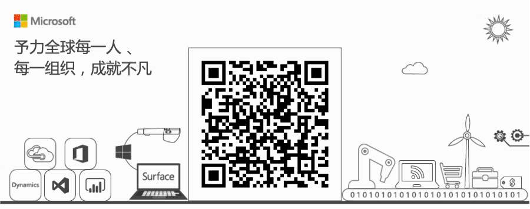 

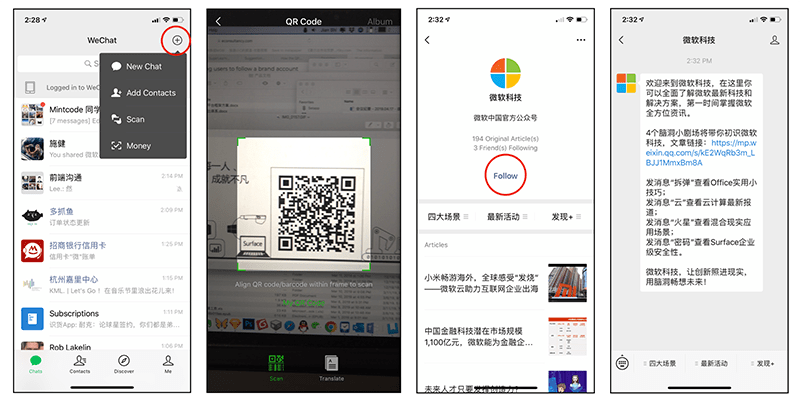 

### 2. Use a QR code to share WeChat contact information

All WeChat users get their own customized QR code. It can be shown for anyone else to scan or share.

**Note:** QR codes can be scanned by tapping and holding on them.

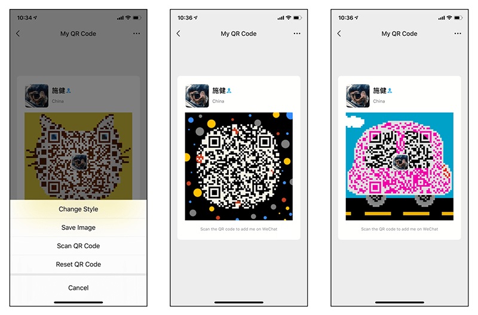

 

### 3. Use a QR code to receive money in Alipay 

Alipay allows users to receive funds via QR code without adding the payee as a contact.

Users create a QR code for the payer to scan and pay.

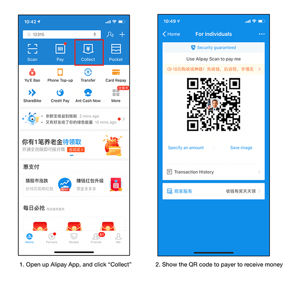 

### 4. Use a QR code to make a payment offline by using WeChat and Alipay

Making a payment to an offline merchant can be done via QR code.

Once your total has been rung up, show your “Pay Vendor” QR code for the merchant to scan and pay.
 
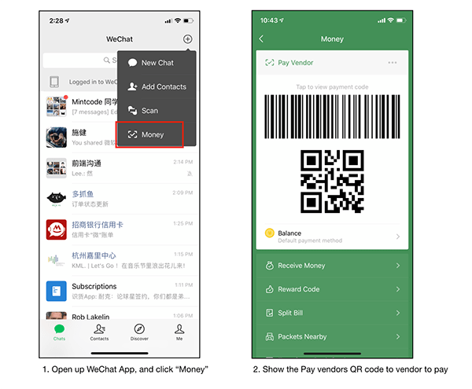 

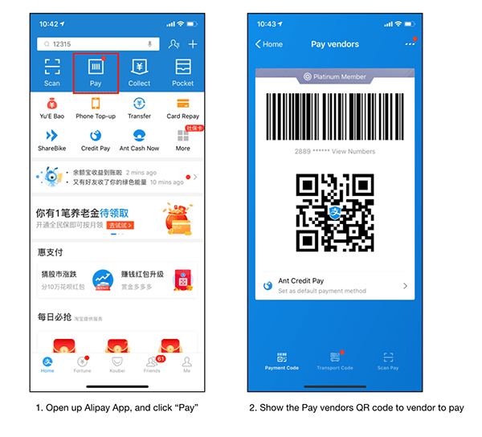 

### 5. Use a QR code to check product history and verification

QR codes are used for linking information such as supply and manufacture dates on the side of the packaging.

 

### 6. Use a QR code to install apps

Companies are using QR codes to distribute Apps to download and install. It is easier than putting a link on ads or asking customers to search in App stores.

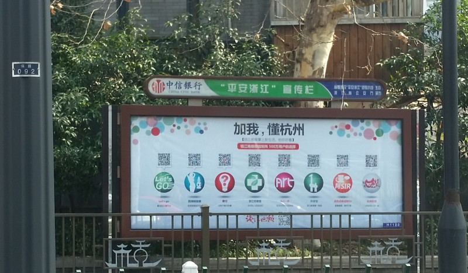
  
### 7. Use a QR code to sign-up and login to websites

Some websites offer login using WeChat’s third-party authentication API - simply use WeChat to scan their QR code.

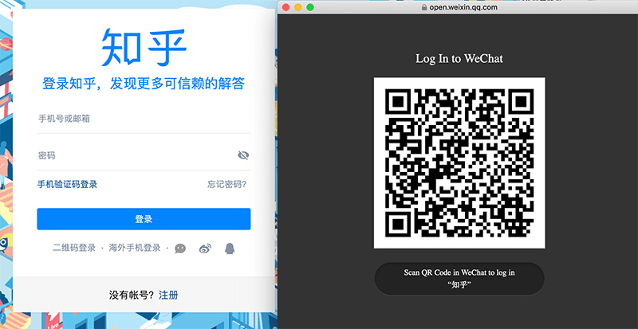

Some social networks also offer login by scanning a QR code using the network’s own app instead of entering a username and a password.

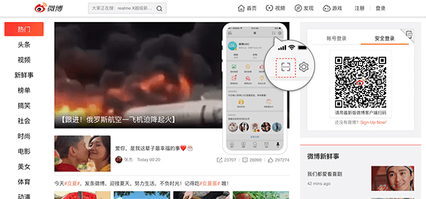

### 8. Use a QR code to connect to a hotspot

Wi-Fi via WeChat is a feature for businesses and public places offering free Wi-Fi hotspots to their customers. It’s a common service in China. Rather than having to find the publicly posted Wi-Fi password, users can login quickly using their WeChat accounts.

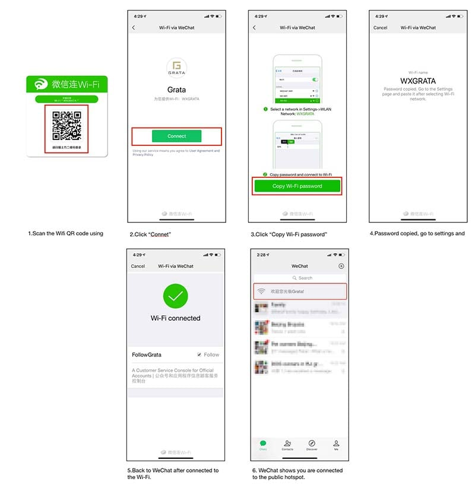

### 9. Use a QR code to ride a bus or subway

You can use QR codes to ride a bus or subway in most main cities in China.

For example, to ride a bus using Alipay QR code in Hangzhou you have to apply for a virtual bus card and use the card when you are boarding a bus.

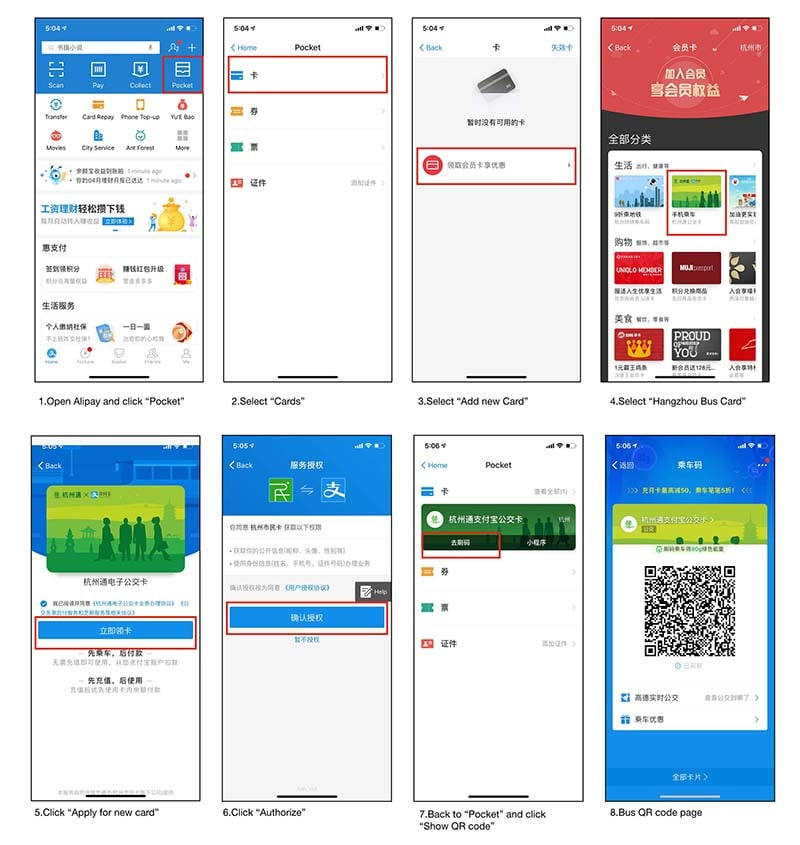

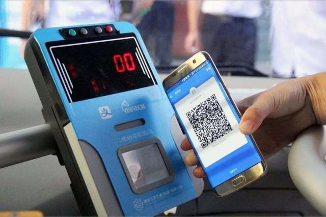 

### 10. Use a QR code to unlock a share-bike

You can rent a bike in China by scanning a QR code on a share-bike.

For example, to rent a Hellobike:

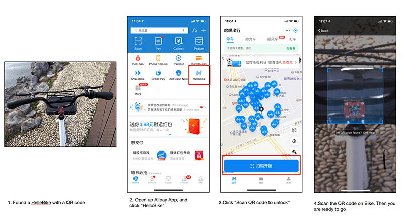

**Note:** Make sure you have funds available in your Alipay account.
