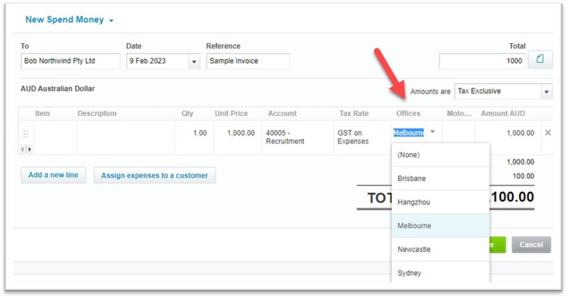

When a company has multiple offices in different locations, it is important to allocate expenses to each office accurately to ensure that the financial reports reflect the true costs of running the business in each location.
Proper expense allocation can also help identify areas of inefficiency and improve cost management.

However, allocating expenses to offices in different locations can be challenging, especially when the expenses are shared among different offices or are difficult to track.
It requires a systematic approach and a set of guidelines to ensure that expenses are allocated fairly and accurately.

### Direct allocation of expenses

If an expense is attributable to a specific office, it should be allocated directly to that office.
This includes expenses such as travel expenses incurred by an employee visiting a specific office or recruitment costs for a particular job opening in a specific office.

E.g. If there is a recruitment ad for an open position in Melbourne with a cost of $1,000, it should be allocated to the Melbourne office.

The office chosen should genuinely reflect the beneficiary.

* If Bob travels from Sydney to Brisbane to give a speech at a conference held by the Brisbane office, the cost should be allocated to Brisbane
* If Bob travels from Sydney to Melbourne for training, then the cost is allocated to Sydney

Automated tools, like accounting software, should be used to streamline the allocation process and reduce the risk of errors.
Accounting software, such as Xero, provides the option to include an office for transactions; however, some overhead costs need to be manually allocated based on a certain rate.

### Allocation of shared expenses and unassigned expenses

If an expense is shared among multiple offices and cannot be directly attributed to a specific office, an administrative rate should be used to allocate the cost across all offices.
The method for calculating the administrative rate should be clearly defined in the company rules. Examples of administrative rate calculation methods include the cost of sales or headcount.

E.g., if there is a recruitment ad for a position advertised for any office, the cost is not directly allocated to a specific office but is instead allocated by an end-of-month adjustment.

Unassigned expenses will be tracked separately and allocated to each office by an end-of-month adjustment. See the figure below. The allocation frequency should be clearly defined in the company rule.
Expenses from the company level can be allocated to each office based on the admin rate which can be calculated by different methods. E.g. Cost of sales.

* These expenses will initially be treated as unassigned when created
* A manual journal will be created by the end of the reporting period

::: good

:::

### Review and Communication

The allocation process should undergo a review by someone with accounting expertise to ensure the accuracy and consistency of the allocation results.

The company rules governing the allocation process should be effectively communicated to all relevant parties.
