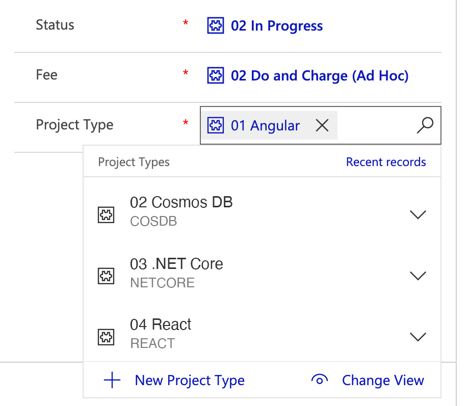
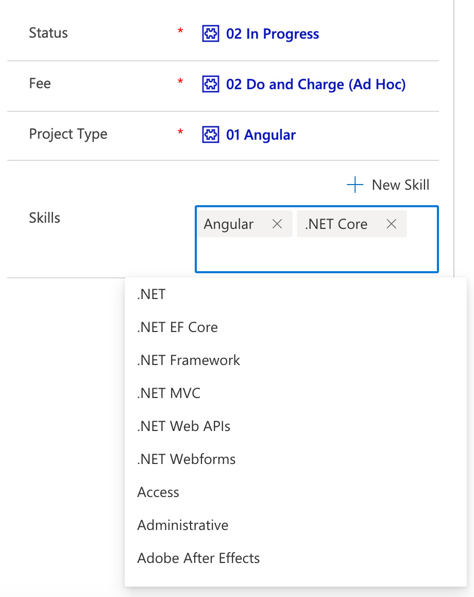

As a developer, we don't always think of the importance of the reporting that the business and marketing professionals use years down the track. It is so easy to give a data entry form a combo box, when a multi-checked list would be a better choice...

<!--endintro-->

::: bad

:::

::: good

:::

Case in point, a project form that has a field called "Skill” (that includes technologies). When a user is entering their project the technologies used may include some Angular, heaps of .NET, and a database like Cosmos DB. When you only have one choice, the obvious thing they can do, is pick the technology that they presume will take up the most development time. Maybe they choose .NET and never think of it again.

Then the problem is later down the track... there is no record of the front end (being Angular) nor the database (being Cosmos DB). Then you have the poor marketing people making uninformed decisions, spending their promotional $$$ based on missing data. If they can't tell which front end tech is growing or dying, they are spending money like a crapshoot in the casino!

These bad decision have enormous impacts on the growth of the business! 🔥

`youtube: https://www.youtube.com/watch?v=5eXx67EY_y4`

`youtube: https://www.youtube.com/watch?v=wLR0e48gou0`

