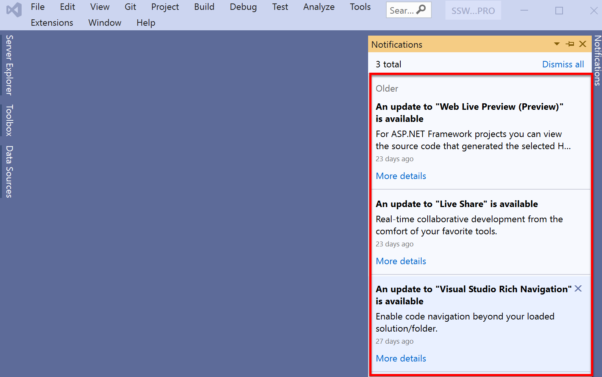

A new version of your software is deployed. How do you tell users important information on older versions?

You shouldn't need to check for updates to be notified of valuable information.

Software is often deployed without any mechanism to insert a message into older versions.

<!--endintro-->

Messages might include notifications to update or simply helpful tips. Eg. Sometimes customers are not aware that their CRM installation is several years old.

