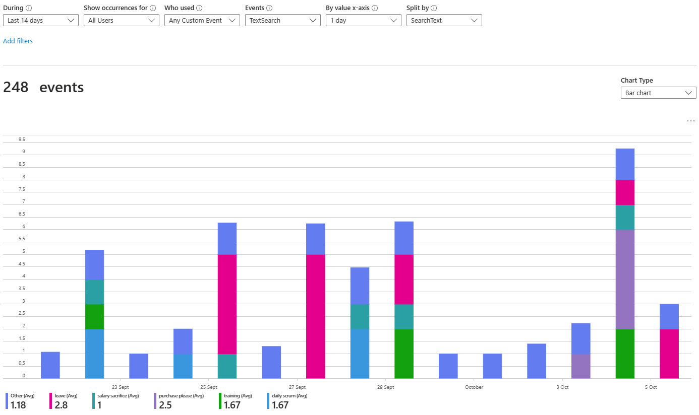

You've set up your Application Insights as per the rule 'Do you know how to set up Application Insights.

Your daily failed requests are down to zero & You've tightened up any major performance problems.

Now you will discover that understanding your users' usage within your app is child's play.

<!--endintro-->

The Application Insights provides devs with two different levels of usage tracking. The first is provided out of the box, made up of the user, session, and page view data. However, it is more useful to set up custom telemetry, which enables you to track users effectively as they move through your app.

  

It is very straightforward to add these to an application by adding a few lines of code to the hot points of your app. Follow [Application Insights API for custom events and metrics](https://learn.microsoft.com/en-us/azure/azure-monitor/app/api-custom-events-metrics) to learn more.

If you feel constricted by the Application Insights custom events blade? Then you can export your data and display it in PowerBI, take a look at [Using Azure Log Analytics in Power BI](https://learn.microsoft.com/en-us/power-bi/transform-model/log-analytics/desktop-log-analytics-overview)

