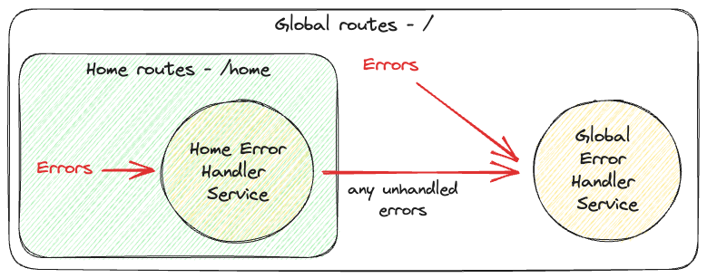

Angular provides built-in error-handling mechanisms such as [ErrorHandler](https://angular.io/api/core/ErrorHandler) and [HttpInterceptor](https://angular.io/api/common/http/HttpInterceptor).

<!--endintro-->


## Handling Uncaught Errors

By providing an `ErrorHandler` class, all uncaught errors will go to this service.

```ts
@NgModule({
  declarations: [...],
  imports: [...],
  providers: [
    {
      provide: ErrorHandler,
      useClass: ErrorHandlerService,
    }
  ],
  ...
})
export class AppModule { }
```

```ts
@Injectable({ providedIn: 'root' })
export class GlobalErrorHandlerService implements ErrorHandler {
  handleError(error: unknown): void {
    // Handle the error here, you can inject services
    console.error('Uncaught error!', error);
  }
}
```

The above example instructs Angular to use `ErrorHandlerService` as the default `ErrorHandler` in the scope of `AppModule`.
Any injectable services can also be injected in the custom `ErrorHandlerService`, allowing various actions to be done in this service.


### Scoping Error Handler
With how Angular treats the `ErrorHandler` as an injectable service, we can also control the scope of the `ErrorHandler`.

For example, if we want to provide a global error handler as a fallback and a specific error handler for a route, we can create a lazy-loaded module for that route and then provide another `ErrorHandler`. This approach will override the existing `ErrorHandler` for this particular route. See also [Limiting provider scope by lazy loading modules](https://angular.io/guide/providers#limiting-provider-scope-by-lazy-loading-modules).

```ts
@NgModule({
  declarations: [...],
  imports: [
    RouterModule.forChild(...),
    ...
  ],
  providers: [
    {
      provide: ErrorHandler,
      // HomeErrorHandlerService is the ErrorHandler for routes under this lazy-loaded module
      useClass: HomeErrorHandlerService,
    }
  ],
})
export class HomeModule { }
```

  
**Figure: Scoping Error Handler in Angular**


## Handling API Errors
All failed API calls not handled (i.e. not caught) will be handled by `ErrorHandler`. There are several ways to handle API errors by hand in cases where we need to do a specific error handling for an API; some of them are:
  - In `Subscribe` method:
    ```ts
    this.http.get('/foo').subscribe({
      next: response => {
        // Handle response
      },
      error: err => {
        // Handle error
        console.error('Error while calling API', err);
      },
    });
    ```

  - In `pipe` using `catchError()`:
    ```ts
    this.http.get('/foo').pipe(
      catchError(err => {
        // Handle error
        console.error('Error while calling API', err);
        return of(null); // Return fallback value
      })
    ).subscribe(response => {
      // Handle response
    });
    ```

### Catching API errors in HTTP Interceptor
Angular provides a mechanism to intercept HTTP calls using [HttpInterceptor](https://angular.io/api/common/http/HttpInterceptor). Interceptors behave like middleware for API calls.
`HttpInterceptor` provides many functionalities, one of which is to alter how API calls behave - specifically on error.

Below is an example of how to handle failed API calls directly in the `HttpInterceptor`:

```ts
// app.module.ts
@NgModule({
  declarations: [...],
  imports: [...],
  providers: [
    {
      provide: HTTP_INTERCEPTORS,
      useClass: GlobalHttpInterceptorService,
      multi: true,
    },
  ],
  ...
})
export class AppModule { }

// global-http-interceptor.service.ts
@Injectable({ providedIn: 'root' })
export class GlobalHttpInterceptorService implements HttpInterceptor {
  intercept(
    req: HttpRequest<any>,
    next: HttpHandler
  ): Observable<HttpEvent<any>> {
    return next.handle(req).pipe(
      catchError(err => {
        // Handle API error
        console.error('Error while calling API', err);
        return of(err);
      }),
    );
  }
}
```

Note that since we can manipulate how we return the original request with `next.handle(req)`, we can also implement more advanced patterns like retries.
