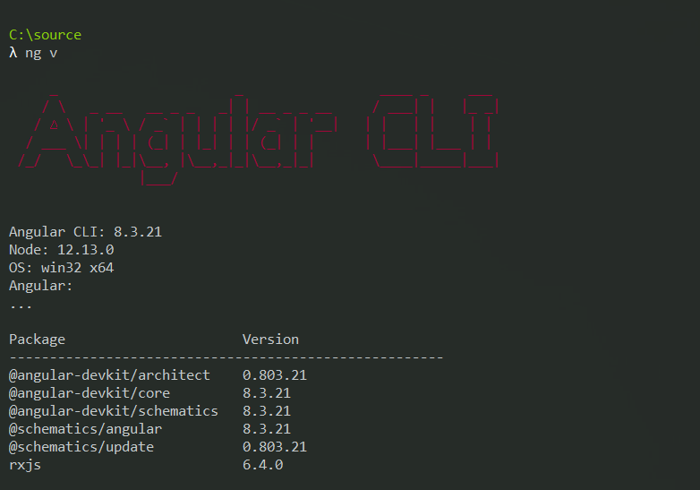

This rule explains what to install in order to get started creating an Angular project.

The best practice for creating an Angular project and components is to use the [Angular CLI](https://angular.io/cli) (command-line interface).

The Angular CLI is also used in the latest .NET Angular SPA template. 
Read [Do you know that the ASP.NET Core SPA Template for Angular uses the Angular CLI?](/asp-net-core-spa-template-for-angular-uses-the-angular-cli)

The libraries that are required to get started are:

1. **Node.js** (https://nodejs.org/) and  **NPM** (https://www.npmjs.com/)
2. **Git** (https://git-scm.com/), and
3. **Angular CLI** (https://angular.io/cli)


<!--endintro-->

### 1. Node.js and NPM

The first step is to install Node.js, which comes bundled with NPM.  Node.js is a JavaScript runtime that will allow NPM (Node Package Manager) to run on your local machine. NPM allows the installation and management of 3<sup>rd</sup> party JavaScript libraries on your local machine and Angular project.

Check that you have a version of Node.js installed that is compatible with the [latest version of Angular](https://angular.io/guide/quickstart%22%20%5cl%20%22nodejs). The latest Long Term Support (LTS) version of Node.js is a safe bet.

To check you have the correct version of Node.js run the following from a terminal/command window.

If you have older versions of Node.js or don't have it installed, please install the latest LTS version from here: [https://nodejs.org/en](https://nodejs.org/en/)

As of Angular 9, you need to be on Node 11+.


```
node -v
```

Check that you are running NPM 6+ by running the following from a terminal/console window:

```
npm -v
```

If you have a version of NPM &lt; 6, install the latest version running the following command from a terminal/console window. If you don’t have NPM installed, use the Node.js installer to install NPM.

```
npm install -g npm@latest
```

### 2. Git 


Install git [https://git-scm.com](https://git-scm.com/)

Check you have git by running the following from a terminal/command window:

```
git --version
```

### 3. Angular CLI
Check you have the latest version of the Angular CLI installed globally by running the following command in the terminal/command window.  Check the result against the latest version shown on GitHub here: https://github.com/angular/angular-cli.


```
ng v
```

If you don’t have Angular CLI installed, then run the command below in a terminal/command window to install it.

```
npm install -g @angular/cli
```

If you are not running the latest version, we recommend you run the below commands to update the global version of the Angular CLI.

```
npm install -g @angular/cli@latest
```

Upgrading the global Angular CLI version will not affect the version of the Angular CLI being used by existing local project.  Multiple versions of the Angular CLI can run on the same machine, and the project specific version of Angular CLI will continue to be used by the project until you manually upgrade the project’s local version.

Instructions for upgrading the Angular CLI of an existing project can be found here: [https://update.angular.io](https://update.angular.io/)

  

### Getting errors?

If you get node gyp errors, follow instructions here: https://github.com/nodejs/node-gyp

If you get permission errors, follow instructions here: https://docs.npmjs.com/getting-started/fixing-npm-permissions


### Which IDE should I use for developing Angular applications?

We recommend you use  **VSCode** - [http://code.visualstudio.com](http://code.visualstudio.com/)
Read more on [Do you know the best IDE for Angular?](/how-to-get-your-machine-setup)
