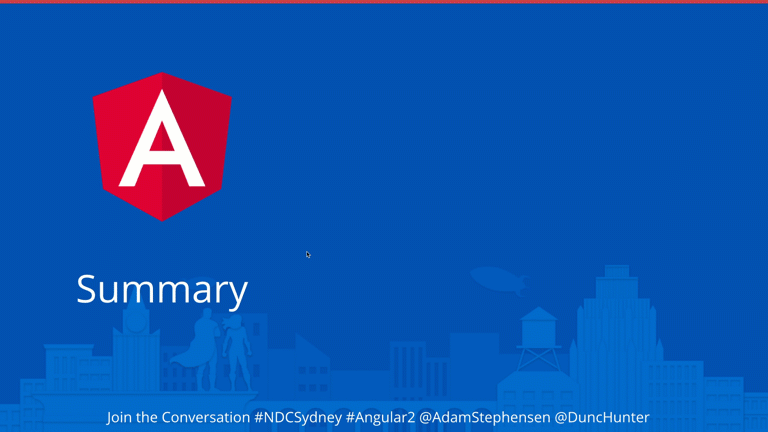

When you show all of your content on a slide when it first loads many people will read ahead of what you are saying.

The summary slide is very important. It's your chance to re-iterate what you have covered in the talk, and remind the audience of your key points.

<!--endintro-->

You want them listening to you, not reading ahead.

Animating the items on your Summary slide ensures they are listening to you, not reading ahead.

::: good  
  
:::
