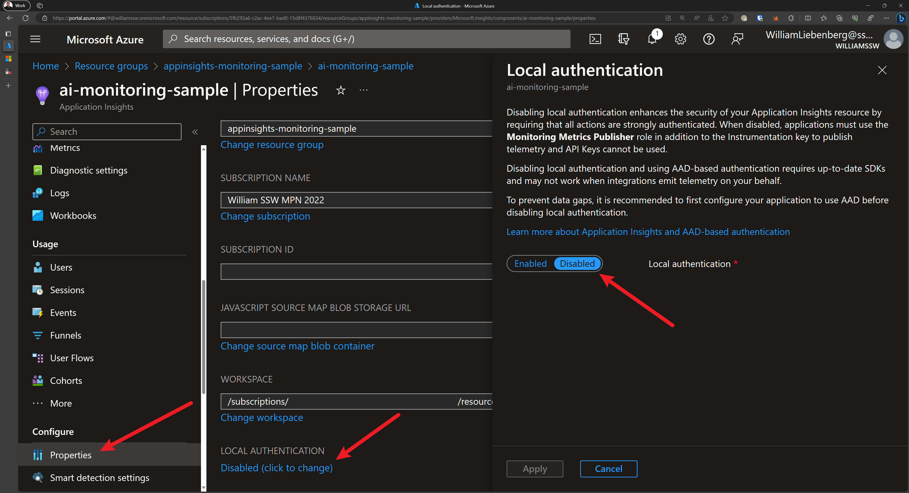
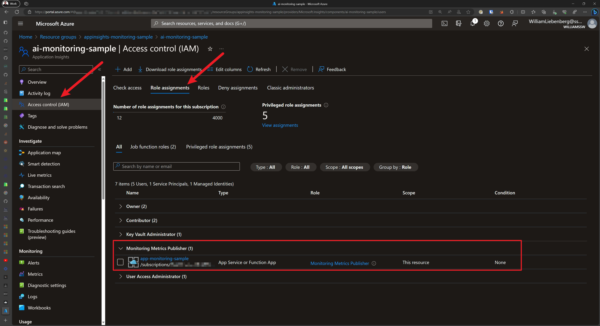

Azure Application Insights is your app's friendly doctor, keeping an eye on it to stay healthy and running smoothly. It uses an `Instrumentation Key` (IK) to allow your app to send telemetry data to its resource.

While this IK isn't a secret and is often included in client-side code, if it IK falls into the wrong hands, they could spam your telemetry or incur extra costs on ApplicationInsights.

The IK **does not** grant users access to **read** your data. In order for an application or a user to read your telemetry data, they need to authenticate into Application Insights with Entra ID (used to be Azure AD).

For client-side telemetry (e.g. Static Web Pages, Single Page Apps) the key will be visible in the browser via Dev Tools, but it is comforting to know that all the Application Insights telemetry is sent over HTTPS.

To prevent unintended access, Local authentication (via Instrumentation Key or API Keys) can be **disabled** for authenticating data ingestion. Once disabled, a **stronger authentication** method known as Role **Based Access Control (RBAC)** can be used.

<!--endintro-->

With Role-Based Access Control (RBAC) we can define the specific applications and users that have the ability to send telemetry data, making unauthorized data injection harder.

This method also allows for more accurate Monitoring and Auditing because it allows us to log who accessed our resources and what actions they performed, which is crucial for security.

In summary, disabling local authentication and relying on Entra ID RBAC for telemetry ingestion in Azure Application Insights allows for more robust security measures, ensuring that only authorized entities can submit telemetry data.



## Pros and Cons 

| Pros        | Cons           |
|:-------------|:-------------|
| ✅ No spam telemetry      | ❌ Does not work for Client-Side applications |
| ✅ Perfect for Server-side applications      | ❌ Two Application Insights instances to collect Client and Server-side telemetry     |
| ✅ Accurate telemetry - Exact applications, servers, services are listed       | ❌ Custom Queries and Dashboards to combine Client and Server-side telemetry     |

## Securing Application Insights

In short, to secure the telemetry sent from your application to Application Insights, follow these steps:

1. Use System-assigned or User-assigned Managed Identity with AppService
2. Disable Local Authentication to enable RBAC
3. Assign the `Monitoring Metrics Publisher` role to the AppService
4. Authenticate your application against AppInsights using a managed identity

### Sample Application

Check out the sample ASP.NET Core application and Bicep code from [William Liebenberg](https://ssw.com.au/people/william-liebenberg) on [GitHub](https://github.com/william-liebenberg/AppService-AppInsights-Monitoring)

### Add Managed Identity to AppService

To provision an Azure AppService with a System Assigned managed identity, add the following to your Bicep code:

```bicep
resource appService 'Microsoft.Web/sites@2022-09-01' = {
  name: appServiceName
  location: location
  identity: {
    // ⬇️ add the code below for Azure to automatically assign a managed identity to the AppService 
    type: 'SystemAssigned'
  }
  // ... the rest of your app service configuration
```
::: good
Figure: Enable System Assigned managed identity
:::

### Enable Role Based Access Control for Application Insights using Bicep

When provisioning your Application Insights resource using Bicep, you can enable RBAC by setting `DisableLocalAuth` to `true`.

```bicep
resource appInsights 'Microsoft.Insights/components@2020-02-02' = {
  name: appInsightsName
  location: location
  kind: 'web'
  tags: tags
  properties: {
    Application_Type: 'web'
    Flow_Type: 'Bluefield'
    Request_Source: 'rest'
    WorkspaceResourceId: logAnalyticsWorkspace.id
    DisableLocalAuth: true // Enables RBAC
  }
}
```

::: good
Figure: Disable Local Authentication to enable Enhanced Security for Application Insights using Bicep
:::

Disabling the local authentication enables RBAC which means that only users and applications with the `Monitoring Metrics Publisher` role and the appropriate instrumentation key will be able to track telemetry with this instance of Application Insights.

### Assigning Monitoring Metrics Publisher Role to AppService using Bicep

To give an Azure AppService the capability of sending telemetry to an Application Insights instance with RBAC enabled, the AppService must have the `Monitoring Metrics Publisher` role assigned to it.

There are a couple of Azure quirks that make this less than trivial, but it is also not too complicated.

1. Get the Role Definition using the Azure CLI:

```ps1
az role definition list --name "Monitoring Metrics Publisher" --output json --query '[].{description:description, name:name, roleName:roleName}'
```

Output:

```json
[
  {
    "description": "Enables publishing metrics against Azure resources",
    "name": "3913510d-42f4-4e42-8a64-420c390055eb",
    "roleName": "Monitoring Metrics Publisher"
  }
]
```

The `name` field is a `GUID` that you use in the Bicep code to assign a role to an entity.

2. Add the following Bicep code to assign the `Monitoring Metrics Publisher` role to an Azure AppService:

```bicep
// Get the existing Monitoring Metrics Publisher role definition
resource monitoringMetricsPublisherRoleDefinition 'Microsoft.Authorization/roleDefinitions@2022-04-01' existing = {
  scope: subscription()
  name: '3913510d-42f4-4e42-8a64-420c390055eb'
}

// Assign the Monitoring Metrics Publisher role to the AppService identity
resource monitoringMetricsPublisherRoleAssignment 'Microsoft.Authorization/roleAssignments@2022-04-01' = {
  name: guid(appInsights.id, appService.id, monitoringMetricsPublisherRoleDefinition.id)
  scope: appInsights
  properties: {
    principalType: 'ServicePrincipal'
    roleDefinitionId: monitoringMetricsPublisherRoleDefinition.id
    principalId: appService.identity.principalId
  }
}
```

::: good
Figure: Assigning Monitoring Metrics Publisher role to AppService Managed Identity using Bicep
:::



### Authenticating with Application Insights

For ASP.NET Core applications running on Azure AppServices with the `Monitoring Metrics Publisher` role assigned, we can use a managed identity (System-assigned or User-assigned) to authenticate the application with a particular AppInsights instance.

We accomplish this by using one of the following [credential types](https://github.com/Azure/azure-sdk-for-net/tree/main/sdk/identity/Azure.Identity#authenticate-azure-hosted-applications):

1. `DefaultAzureCredential` for local development
2. `ManagedIdentityCredential` for apps running in Azure with system-assigned or user-assigned managed identities
     - For system-assigned, use the default constructor without parameters.
     - For user-assigned, provide the `client ID` to the constructor.

Once the credential has been created, pass it to the Application Insights `TelemetryConfiguration`:

```cs
using AppService.AppInsights.Monitoring;
using Azure.Identity;
using Microsoft.ApplicationInsights;
using Microsoft.ApplicationInsights.Extensibility;
using Microsoft.AspNetCore.Mvc;

var builder = WebApplication.CreateBuilder(args);

// authenticate using Default (managed identity) Credentials for AppInsights
builder.Services.Configure<TelemetryConfiguration>(config =>
{
    var credential = new ManagedIdentityCredential();
    config.SetAzureTokenCredential(credential);
});

// When using AppInsights and User Secrets for local development:
// - Strange behavior:  
//    When using the parameterless version of `.AddApplicationInsightsTelemetry()`, 
//    the various Initializers and TelemetryClient do not receive the
//    `ApplicationInsights:ConnectionString` specified in `secrets.json`
//
// - Fix: Pass in `builder.Configuration` to `.AddApplicationInsightsTelemetry()`
//
// - Result: the Initializers and TelemetryClients are configured properly
builder.Services.AddApplicationInsightsTelemetry(builder.Configuration);

// ---- the rest of Program.cs ----

```

::: good
Figure: Using Managed Identities when authenticating with Application Insights
:::

Once the application starts up, authenticates with Application Insights, then you can start observing telemetry in the Application Insights resource or Application Dashboards.

Happy monitoring!
