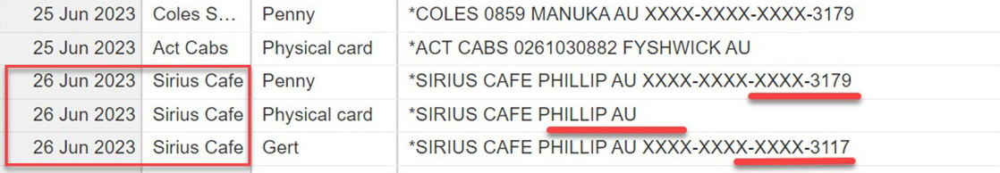

When a company manages its small expenses, it is common to let the employees use a company credit card to avoid staff being blocked by reasonable purchases after appropriate authorization. 

Accountants are aware of the risks that come with sharing one credit card amongst multiple employees as transactions often become unaccountable as well as presenting opportunities for unauthorised use. However, issuing credit cards to each employee also brings pain due to extra administrative overhead and the increased risk of lost/stolen cards. 

To simplify expense management and improve financial processes, we encourage the use of Apple/Google Pay for company expenses. Adopting virtual wallets as the preferred payment method for in-store purchases streamlines expense management, increases accountability, and improves company expenditures management.

<!--endintro-->

### Efficient Expense Tracking

Each Apple Pay / Google Pay will have a unique card number and will always show on the bank statement when making EFTPOS purchases (in-store purchases), and accountants will know who made the payment.

For example, here are 3 purchases from the same vendor at the same time. By referring to the unique card number from the statement, it can be determined that 2 payments were made by different staff members, while 1 of them was paid with a physical credit card.

Apple/Google Pay provides a centralized and easily accessible record of transactions. Each purchase generates a digital receipt, capturing important details such as the date, time, amount, and vendor information. This streamlined record-keeping simplifies expense tracking and reduces the administrative burden of manual expense reporting. Integrating Apple/Google Pay with expense management software allows for seamless synchronization of transaction data, providing real-time visibility into expenditure patterns

* Find out [how to see your Apple Pay transaction history](https://support.apple.com/en-au/HT212786)
* Find [Google transactions on Pay](https://guidebooks.google.com/google-pay-us/get-financial-insights-with-google-pay/how-to-check-google-pay-transaction-history) 

### Enhanced Security and Fraud Protection

Apple/Google Pay incorporates robust security measures to protect against fraud and unauthorized transactions. Tokenization and biometric authentication ensure that only authorized individuals can initiate and complete transactions. By encouraging staff to use Apple/Google Pay, we can mitigate potential financial risks and safeguard company resources.

::: greybox
**Scenario:** Everyone share the same credit card detail, hard to know who made the purchase.
:::

::: bad
Bad example 
:::

::: greybox
**Scenario:** Everyone receives a physical card, with each of them having independent card details (a risk multiplier). The accountants know who paid the money, but hard to manage them and easy to get hacked.
:::

::: ok
OK example 
:::

::: greybox
**Scenario:** Everyone can access funds through Apple/Google Pay without creating separate credit cards, and the payment must be approved through the phone with biometric authentication.
:::

::: good
Good example
:::

There is also an option that company can manage those expenses through third parties. 

✅ **Pro:** They usually provide good reporting, customized credit limits and are good for controlling your budget.   
❌ **Con:** It can be costly, carrying the risk of potential financial loss if the third party faces bankruptcy and forfeiting your credit card rewards.
    
The business owners need to decide to take risks on the employee or the other business.

### No Maintenance Fees

Apple/Google Pay is free. Physical credit cards may charge an admin fee, but they can be avoided by switching to Apple/Google Pay.

### Integration with Expense Management Systems

Virtual credit cards seamlessly integrate with various expense management systems, facilitating streamlined expense reconciliation and reporting. Linking Apple/Google Pay transactions directly to expense reports automates the reconciliation process and eliminates manual data entry. This integration provides accurate and up-to-date expense information, enabling comprehensive financial reporting and analysis. It also facilitates efficient auditing and compliance monitoring.

### Keep Earning Rewards

When using Apple/Google Pay, you still get the same benefits and rewards as you do with physical credit cards.
