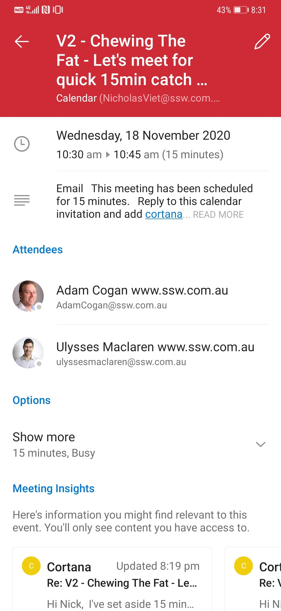

We've all been part of that email chain... "Let's meet to discuss this", "When are you free?", "I can do Friday", "Friday's no good, what about Monday?", "I'm free in the morning", "Penny can't make that, how about Tuesday afternoon after 3?", etc.

AI can make scheduling meetings with multiple attendees much easier. 

Note that both of the following solutions work best when you're dealing with people in your own organization, as they then have access to all calendar data, but with a bit of back and forth, they can still work for externals too.

<!--endintro-->

### Microsoft Cortana Scheduler (formerly known as Calendar.help)

<dl class="ssw15-rteElement-ImageArea"> 
    
</dl>
This option is best if you're ok to meet any time that your calendar says is free.

**Instructions to use Cortana:** 
 **Step 1:** Register yourself at     https://calendar.help/ before you can use this feature. **
**

**Step 2:** Open an email... not an appointment!

::: greybox
To:      [person]
Cc:      Cortana@calendar.help
Body:  after your normal text to a person, add some extra text like "Cortana, schedule a meeting."

:::

Cortana then handles all the back-and-forth emails to find a time when everyone can meet and then she sends out an invite on your behalf.

**More help for Cortana:** 
1. More on     https://calendar.help/ and see the FAQ
2. Watch the video here     https://www.microsoft.com/en-us/scheduler
<dl class="goodImage">&lt;dt&gt;
      
   &lt;/dt&gt;<dd>Figure: Speak to Cortana as you would a PA</dd></dl><dl class="goodImage">&lt;dt&gt;
      
   &lt;/dt&gt;<dd>Figure: Cortana will find a time that suits everyone and send the appointment</dd></dl>
**Step 3:** To make it easier to add Cortana to your emails, create a Contact.
<dl class="image">&lt;dt&gt; 
      &lt;/dt&gt;<dd>Figure: Cortana added as a contact </dd></dl>
**Mobile – works great ✔**
<dl class="image">&lt;dt&gt; 
       
   &lt;/dt&gt;<dd>Figure: Microsoft Scheduler – Fully works on mobile phone </dd></dl>
### FindTime

This option is best if you want to be selective about a few options for when to meet, and send a poll to attendees to choose.

FindTime shows what days and times work the best for you and the attendees when available using free/busy data.

Propose your selected times to all attendees and allow everyone to vote and quickly come to a consensus... and you’re done!

FindTime sends out the meeting invite on your behalf. More on [https://findtime.microsoft.com](https://findtime.microsoft.com/)
<dl class="image">&lt;dt&gt; 
       
   &lt;/dt&gt;<dd>Figure: FindTime gives a nice UI for people working in the same org, as you can see times that might be available for all attendees easily (e.g. 8 am above) </dd></dl>
**Mobile – does not work ❌**

As of Dec 2020, FindTime does not work on iOS.

Vote at     [What features would you like to see in FindTime?](https://findtime.uservoice.com/forums/316122-ideas-tell-us-your-great-ideas/suggestions/13358103-findtime-for-iphone-in-outlook-for-ios)

**Note:** Findtime’s competitor is https://calendly.com
<dl class="image">&lt;dt&gt;&lt;/dt&gt;<dd>Figure: FindTime - No mobile support for iOS</dd></dl>
