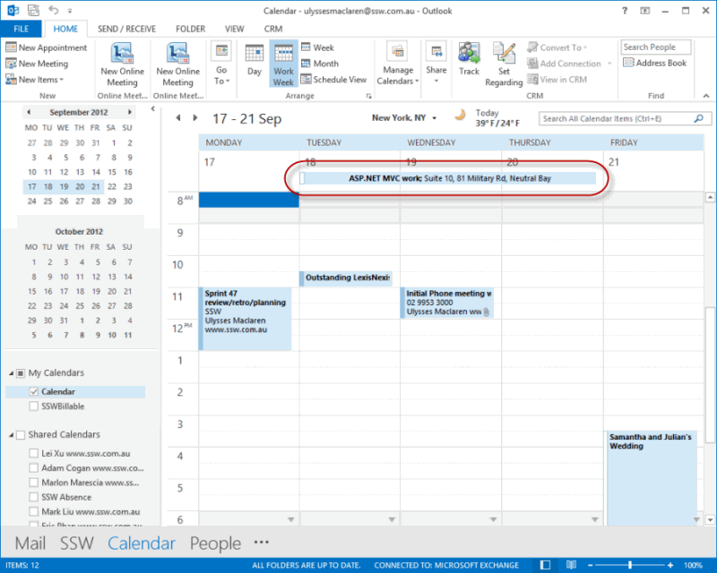

If you wish to organize a meeting that involves some of your colleagues and a client, instead of sending an email, send an appointment. Sending appointments is convenient because all the user has to do is click 'accept' and it is in their calendar. 

<!--endintro-->
<dl class="image">&lt;dt&gt; 
      
   &lt;/dt&gt;<dd>Figure: Use Outlook appointments to easily synchronise your calendar with your client's</dd></dl>
This way Outlook will remind your colleagues about the appointment and you can update them if any changes are made.

If the appointment is for      **3 days or less** , send a separate appointment for each day. This is because multiple-day appointments appear at the top in your Outlook Calendar, so you risk missing the appointment (see below).
<dl class="badImage">&lt;dt&gt;
       
   &lt;/dt&gt;<dd>Figure: Bad Example - Multiple-day appointments appear hidden at the top of your Outlook calendar, so you might miss it, thinking that the time is free </dd></dl><dl class="goodImage">&lt;dt&gt;
       
   &lt;/dt&gt;<dd>Figure: Good Example - Send a separate appointment for each day so you can clearly see it in your Outlook calendar</dd></dl>
