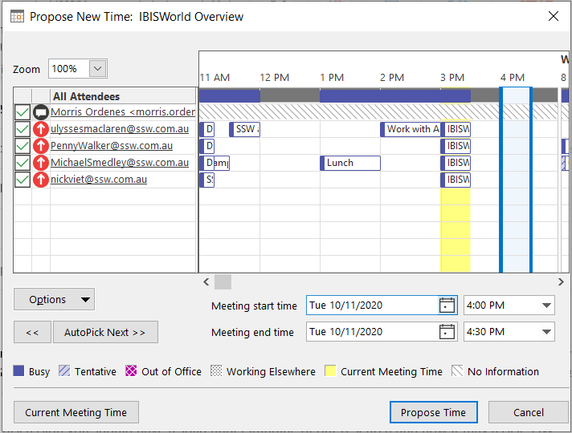

When you would like to propose a new time for an appointment that someone has sent to you, use the Propose New Time button in Outlook instead of simply declining the message. By using the Propose New Time option, the requestor can easily accept your proposed time, rather than having to edit the previous appointment.

<!--endintro-->
<dl class="badImage">&lt;dt&gt; &lt;/dt&gt;<dd>Figure: Bad Example: The person who sent the appointment has to interpret your message, then go back in and edit the appointment</dd></dl>
Instead of simply declining the message and typing your proposed time in the message body, propose a new time as follows:
<dl class="goodImage">&lt;dt&gt; &lt;/dt&gt;  ::: good Figure: Good Example - Click one of these... and then...   :::  &lt;dt&gt; &lt;/dt&gt;<dd>Figure: Good Example - The new time is proposed, and the person who sent the original appointment can easily accept your proposal (or view all proposals if there are multiple recipients) </dd></dl>
