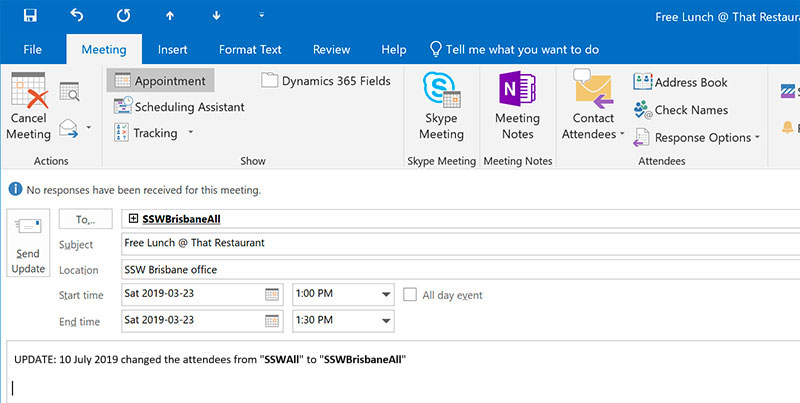

Whenever you have to modify the time, attendees, or subject of an appointment, always send the updated one with comments at the top to explain why you want to make these changes.

<!--endintro-->

Examples:

::: greybox
UPDATED: Moving to Thursday as Adam could not make it

:::

::: good
Figure: Good example – changing the date or time

:::

::: greybox
UPDATED: Adding Uly since he may want to know that we are working on TimePro this day  
:::

::: good
Figure: Good example - adding someone

:::

::: greybox
UPDATED: Change the subject as we will be taking about Marketing first  
:::

::: good
Figure: Good example – changing the subject

:::

This will help to solidify the changes and alleviate confusion.

  

### Related Rule

* [Do you know to update a blog?](/do-you-know-to-update-a-blog)
