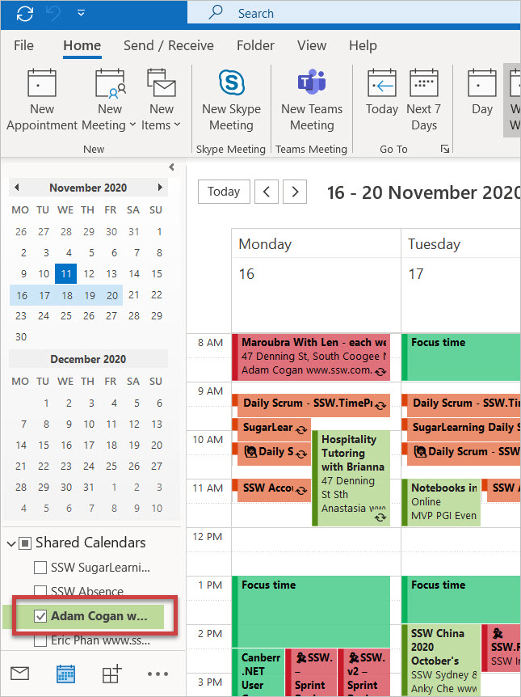
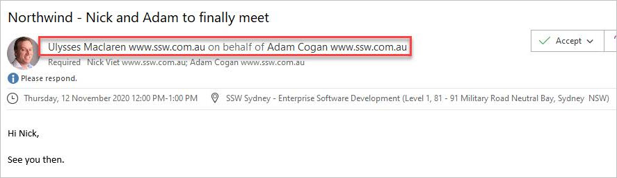

If someone has [shared their calendar permissions](/calendar-do-you-allow-full-access-to-calendar-admins) with you, you will be able to send appointments on their behalf.

If someone wants you to send an appointment for them, but you don't want it to appear in your own calendar, this is the way to go.

When sending an appointment from someone else's calendar, you should always include that person as an attendee so that they also receive the same appointment email that their guests do. It shows them that the invitation has been sent, and also allows them to check for any mistakes or additional information that needs to be added. 

<!--endintro-->

