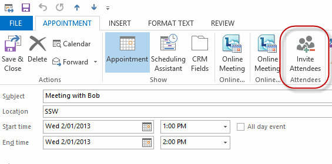
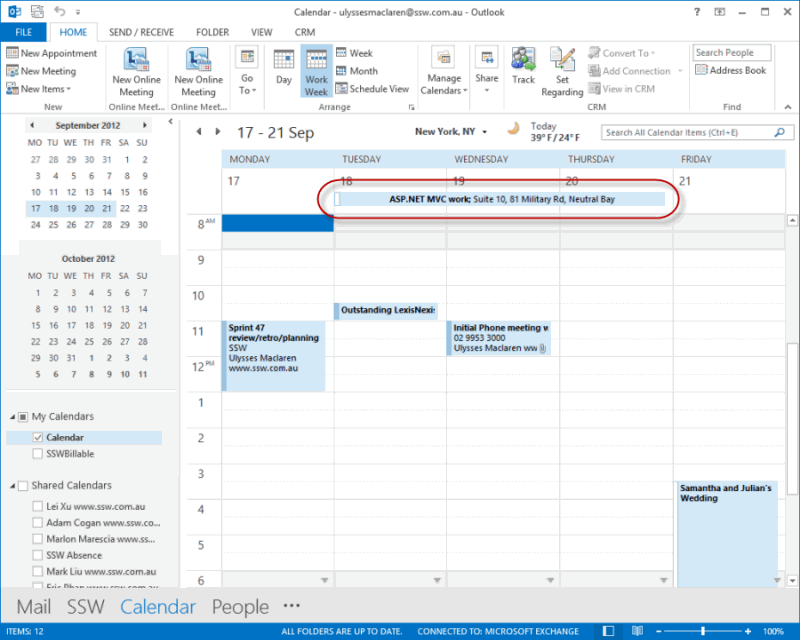
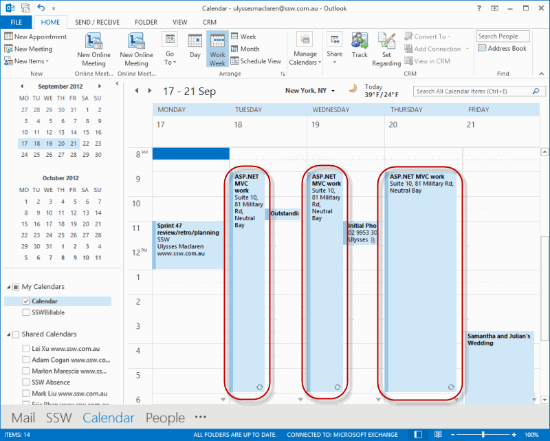

If you wish to organize a meeting that involves some of your colleagues and a client, instead of sending an email, send an appointment. Sending appointments is convenient because all the user has to do is click 'accept' and it is in their calendar. 

<!--endintro-->

  

This way Outlook will remind your colleagues about the appointment and you can update them if any changes are made.

If the appointment is for **3 days or less**, send a separate appointment for each day. This is because multiple-day appointments appear at the top in your Outlook Calendar, so you risk missing the appointment (see below).

::: bad  
  
:::

::: good  
  
:::
